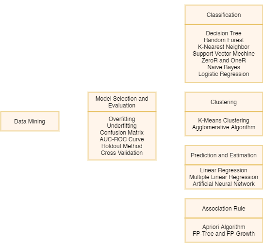

# Data Mining and Knowledge Management UTS
  

> Data Mining adalah proses yang menggunakan teknik statistik, matematika, kecerdasan buatan, machine learning untuk mengekstraksi dan mengidentifikasi informasi yang bermanfaat dan pengetahuan yang terkait dari berbagai database besar.

## Mind Map

## Metode Learning
1. **Supervised learning**, merupakan sebuah pendekatan dimana sudah terdapat data yang dilatih, dan terdapat variable yang ditargetkan sehingga tujuan dari pendekatan ini adalah mengkelompokan suatu data ke data yang sudah ada.
2. **Unsupervised learning**, merupakan sebuah pendekatan dimana data yang dilatih tidak memiliki label (variabel yang ditargetkan tidak ada) sehingga tujuan dari pendekatan ini adalah mengelompokkan data tersebut menjadi 2 bagian, 3 bagian, dan seterusnya
3. **Semi-supervised learning**, merupakan metode data mining yang menggunakan data dengan label dan tidak berlabel sekaligus dalam proses pembelajaran

## Cara Menggunakan

Untuk memakai source code silahkan klik tombol `Code` kemudian pilih `Download ZIP` atau silahkan forking repository ini ke komputermu. Source code yang tersedia adalah:
1. R, yang tersedia adalah file `.Rmd` dan `.html`. Untuk menggunakan file `.Rmd` silahkan menggunakan aplikasi [RStudio](https://rstudio.com/)
2. Python, yang tersedia adalah file `.py`, `.html`, dan `.ipynb`. Untuk menggunakan file `.ipynb` silahkan gunakan Jupyter Notebook dari [Anaconda](https://www.anaconda.com/)

Jika source code yang tersedia terdapat kesalahan silahkan hubungi Tim Modul 60 atau langsung lakukan **pull request** ke repository ini.

Jika kalian ingin **berkontribusi** silahkan forking repository ini dan lakukan **pull request**.

## R Code
1. [Decision Tree](https://github.com/modul60stis/dmkm/tree/main/r/Decision%20Tree#decision-tree-)
2. [Association Rule](https://github.com/modul60stis/dmkm/tree/main/r/Association%20Rule#association-rule-)
3. [Analisis Regresi](https://github.com/modul60stis/dmkm/tree/main/r/Analisis%20Regresi#regresi-linear-)
4. [Hierarchical Clustering](https://github.com/modul60stis/dmkm/tree/main/r/Hierarchical#hierarchical-clustering-)
5. [K-Means Clustering](https://github.com/modul60stis/dmkm/tree/main/r/K-Means#k-means-clustering-)
6. [K-Nearest Neigbors](https://github.com/modul60stis/dmkm/tree/main/r/KNN#k-nearest-neighbor-)
7. [Naive Bayes](https://github.com/modul60stis/dmkm/tree/main/r/Naive%20Bayes#naive-bayes-)
8. [OneR](https://github.com/modul60stis/dmkm/tree/main/r/OneR#oner-)
9. [Random Forest](https://github.com/modul60stis/dmkm/tree/main/r/Random%20Forest#random-forest-)
10. [Regresi Logistik](https://github.com/modul60stis/dmkm/tree/main/r/Regresi%20Logistik#regresi-logistic-)
11. [Support Vector Mechine](https://github.com/modul60stis/dmkm/tree/main/r/SVM#support-vector-mechine-svm-)
12. [ZeroR](https://github.com/modul60stis/dmkm/tree/main/r/ZeroR#zeror-)
13. [Neural Network](https://github.com/modul60stis/dmkm/tree/main/r/neural%20network#neural-network-)

## Python Code
1. [Decision Tree](https://github.com/modul60stis/dmkm/tree/main/python/desicion%20tree#decision-tree-classifier-)
2. [Association Rule](https://github.com/modul60stis/dmkm/tree/main/python/association%20rule#association-rules-)
3. [Linear Regression](https://github.com/modul60stis/dmkm/tree/main/python/linear%20regression#linear-regression-)
4. [Hierarchical Clustering](https://github.com/modul60stis/dmkm/tree/main/python/hierarchical%20clustering#hierarchical-clustering-)
5. [K-Means Clustering](https://github.com/modul60stis/dmkm/tree/main/python/k-means%20clustering#k-means-clustering-)
6. [K-Nearest Neigbors](https://github.com/modul60stis/dmkm/tree/main/python/knn#k-nearest-neighbors-)
7. [Naive Bayes](https://github.com/modul60stis/dmkm/tree/main/python/naive%20bayes#naive-bayes-classifier-)
8. [OneR](https://github.com/modul60stis/dmkm/tree/main/python/oneR#oner-)
9. [Random Forest](https://github.com/modul60stis/dmkm/tree/main/python/random%20forest#random-forest-classifier-)
10. [Regresi Logistik](https://github.com/modul60stis/dmkm/tree/main/python/logistic%20regression#logistic-regression-)
11. [Support Vector Mechine](https://github.com/modul60stis/dmkm/tree/main/python/svm#support-vector-machine-)
12. [ZeroR](https://github.com/modul60stis/dmkm/tree/main/python/zeroR#zeror-)
13. [Neural Network](https://github.com/modul60stis/dmkm/tree/main/python/neural%20network#neural-network-)

##
 

*R Code by Fikri Septian Anggara | Python Code by Eko Putra Wahyuddin*

*-- TIm Modul 60*

 

