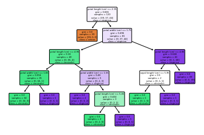
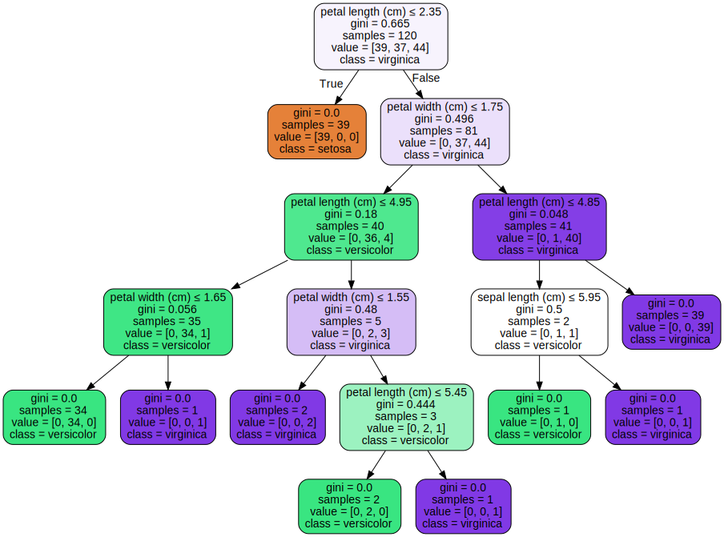
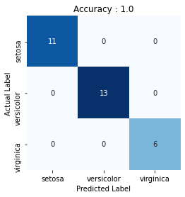

# Decision Tree Classifier 

[](https://GitHub.com/Naereen/) 


### Import library required
Library yang digunakan adalah **pandas, numpy, matplotlib, seaborn, dan sklearn**. Silahkan install terlebih dahulu jika belum menginstallnya dengan perintah `pip install nama-library`.


```python
%matplotlib inline
import numpy as np
import pandas as pd
import matplotlib.pyplot as plt
import seaborn as sns

from sklearn.model_selection import train_test_split
from sklearn.tree import DecisionTreeClassifier
from sklearn.tree import plot_tree
from sklearn.datasets import load_iris
from sklearn.metrics import confusion_matrix
from sklearn.metrics import accuracy_score
```

### Load Data
Data yang digunakan adalah data bawaan sklearn library. Jika ingin menggunakan data sendiri silahkan pakai perintah `pd.read_csv()` atau `pd.read_excel()`


```python
data = load_iris(as_frame=True)
X, y = data.data, data.target

data.frame
```


<div>
<table border="1" class="dataframe">
  <thead>
    <tr style="text-align: right;">
      <th></th>
      <th>sepal length (cm)</th>
      <th>sepal width (cm)</th>
      <th>petal length (cm)</th>
      <th>petal width (cm)</th>
      <th>target</th>
    </tr>
  </thead>
  <tbody>
    <tr>
      <th>0</th>
      <td>5.1</td>
      <td>3.5</td>
      <td>1.4</td>
      <td>0.2</td>
      <td>0</td>
    </tr>
    <tr>
      <th>1</th>
      <td>4.9</td>
      <td>3.0</td>
      <td>1.4</td>
      <td>0.2</td>
      <td>0</td>
    </tr>
    <tr>
      <th>2</th>
      <td>4.7</td>
      <td>3.2</td>
      <td>1.3</td>
      <td>0.2</td>
      <td>0</td>
    </tr>
    <tr>
      <th>3</th>
      <td>4.6</td>
      <td>3.1</td>
      <td>1.5</td>
      <td>0.2</td>
      <td>0</td>
    </tr>
    <tr>
      <th>4</th>
      <td>5.0</td>
      <td>3.6</td>
      <td>1.4</td>
      <td>0.2</td>
      <td>0</td>
    </tr>
    <tr>
      <th>...</th>
      <td>...</td>
      <td>...</td>
      <td>...</td>
      <td>...</td>
      <td>...</td>
    </tr>
    <tr>
      <th>145</th>
      <td>6.7</td>
      <td>3.0</td>
      <td>5.2</td>
      <td>2.3</td>
      <td>2</td>
    </tr>
    <tr>
      <th>146</th>
      <td>6.3</td>
      <td>2.5</td>
      <td>5.0</td>
      <td>1.9</td>
      <td>2</td>
    </tr>
    <tr>
      <th>147</th>
      <td>6.5</td>
      <td>3.0</td>
      <td>5.2</td>
      <td>2.0</td>
      <td>2</td>
    </tr>
    <tr>
      <th>148</th>
      <td>6.2</td>
      <td>3.4</td>
      <td>5.4</td>
      <td>2.3</td>
      <td>2</td>
    </tr>
    <tr>
      <th>149</th>
      <td>5.9</td>
      <td>3.0</td>
      <td>5.1</td>
      <td>1.8</td>
      <td>2</td>
    </tr>
  </tbody>
</table>
<p>150 rows × 5 columns</p>
</div>


### Split Data
Fungsi `train_test_split`, secara default akan membagi data menjadi 75% data training dan 25% data test. Untuk mengaturnya dapat menggunakan argument `test_size` atau `train_size`. Contoh `train_test_split(X, y, train_test = 0.8)`


```python
X_train, X_test, y_train, y_test = train_test_split(X,y, random_state=0, train_size=0.8)
print("Jumlah Training Data : ", len(X_train), " | Jumlah Test Data : ", len(X_test))
```

    Jumlah Training Data :  120  | Jumlah Test Data :  30
    

### Make Model


```python
clf_entropy = DecisionTreeClassifier()
clf_entropy.fit(X_train, y_train)
clf_entropy.get_params()
```


    {'ccp_alpha': 0.0,
     'class_weight': None,
     'criterion': 'gini',
     'max_depth': None,
     'max_features': None,
     'max_leaf_nodes': None,
     'min_impurity_decrease': 0.0,
     'min_impurity_split': None,
     'min_samples_leaf': 1,
     'min_samples_split': 2,
     'min_weight_fraction_leaf': 0.0,
     'presort': 'deprecated',
     'random_state': None,
     'splitter': 'best'}


### Plot Tree


```python
plt.figure(figsize=(15,10))
plot_tree(clf_entropy, filled=True, feature_names=data.feature_names,  
                     class_names=data.target_names, rounded=True);
```





### Tree visualization with the `graphviz` library
If you use the conda package manager, the graphviz binaries and the python package can be installed with `conda install python-graphviz`. Alternatively binaries for graphviz can be downloaded from the graphviz project homepage, and the Python wrapper installed from pypi with `pip install graphviz`.


```python
from sklearn.tree import export_graphviz
import graphviz 

dot_data = export_graphviz(clf_entropy, out_file=None, 
                     feature_names=data.feature_names,  
                     class_names=data.target_names,  
                     filled=True, rounded=True,
                     special_characters=True)

graph = graphviz.Source(dot_data)  
graph 
```





### Check Accuracy


```python
y_pred = clf_entropy.predict(X_test)
accuracy = accuracy_score(y_test, y_pred)
print("Accuracy :",accuracy)
```

    Accuracy : 1.0
    

### Confusion Matrix


```python
cm = confusion_matrix(y_test, y_pred)
plt.figure()
sns.heatmap(cm, annot=True, square=True, cmap='Blues', xticklabels=data.target_names,
           yticklabels=data.target_names, cbar=False)

plt.xlabel('Predicted Label')
plt.ylabel('Actual Label')
plt.title('Accuracy : {:.3}'.format(accuracy))
```





### Classsification Report


```python
from sklearn.metrics import classification_report
print(classification_report(y_test, y_pred, target_names = data.target_names))
```

                  precision    recall  f1-score   support
    
          setosa       1.00      1.00      1.00        11
      versicolor       1.00      1.00      1.00        13
       virginica       1.00      1.00      1.00         6
    
        accuracy                           1.00        30
       macro avg       1.00      1.00      1.00        30
    weighted avg       1.00      1.00      1.00        30


### Make Prediction
Misalnya kita memiliki bunga dengan sepal_length = 0.4, sepal_width = 1, petal_length = 2.3, dan petal_width = 2.5


```python
predict = clf_entropy.predict([[0.4,1,2.3,2.5]])
data.target_names[predict][0]
```


    'virginica'


