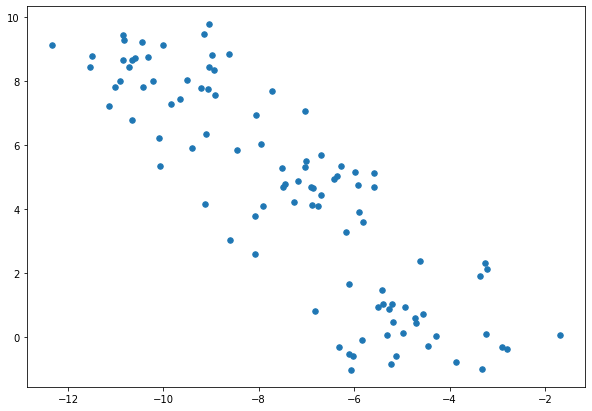
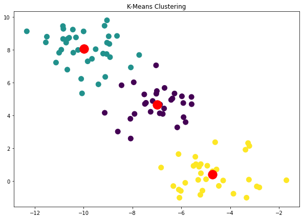

# K-Means Clustering  
[](https://GitHub.com/Naereen/) 


### Load Library
Library yang digunakan adalah **numpy, matplotlib, pand, dan sklearn**. Silahkan install terlebih dahulu jika belum menginstallnya dengan perintah `pip install nama-library`.


```python
import numpy as np
import matplotlib.pyplot as plt
import pandas as pd

from sklearn.datasets import make_blobs
from sklearn.cluster import KMeans
```

### Make Fake Data


```python
X, y = make_blobs(n_samples=100, centers=3, random_state=12)
plt.figure(figsize=(10, 7))
plt.scatter(X[:,0], X[:, 1], s=30);
```





### Make Model
Untuk melihat parameter apa saja yang dapat diatur bisa mnggunakan perintah `help(KMeans)`


```python
kmeans = KMeans(n_clusters=3,random_state=0 )
y_kmeans = kmeans.fit_predict(X)
y_kmeans
```


    array([1, 1, 2, 1, 0, 2, 1, 1, 0, 0, 0, 1, 2, 2, 1, 2, 2, 2, 2, 0, 1, 0,
           1, 2, 1, 2, 2, 0, 1, 2, 1, 0, 0, 1, 0, 0, 1, 2, 1, 2, 1, 1, 1, 0,
           2, 1, 2, 0, 0, 2, 0, 2, 1, 1, 2, 0, 2, 0, 1, 1, 2, 1, 0, 2, 2, 1,
           0, 2, 1, 2, 0, 0, 0, 2, 0, 0, 1, 2, 0, 1, 2, 1, 2, 1, 1, 2, 1, 0,
           1, 1, 0, 1, 2, 0, 2, 0, 2, 1, 0, 0])


### Plot Clustering


```python
plt.figure(figsize=(10,7))
plt.scatter(X[:,0], X[:, 1], s=100, c=y_kmeans)
plt.scatter(kmeans.cluster_centers_[:, 0], kmeans.cluster_centers_[:, 1], s=300, c='red')
plt.title('K-Means Clustering')
```


 




