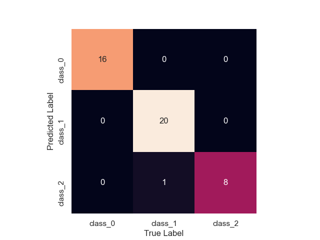
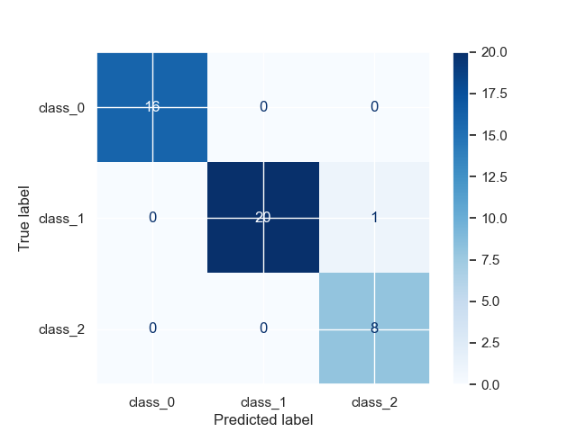

# K-Nearest Neighbors 

[](https://GitHub.com/Naereen/) 

### Import library required
LibrarY yang digunakan adalah **pandas, numpy, matplotlib, seaborn, dan sklearn**. Silahkan install terlebih dahulu jika belum menginstallnya dengan perintah `pip install nama-library`.


```python
%matplotlib notebook
import pandas as pd
import numpy as np
import matplotlib.pyplot as plt
import seaborn as sns
sns.set()

from sklearn.datasets import load_wine
from sklearn.neighbors import KNeighborsClassifier
from sklearn.preprocessing import StandardScaler
from sklearn.model_selection import train_test_split
from sklearn.metrics import confusion_matrix
```

### Load Data
Data yang digunakan adalah data bawaan sklearn library. Jika ingin menggunakan data sendiri silahkan pakai perintah `pd.read_csv()` atau `pd.read_excel()`


```python
data = load_wine(as_frame=True)
data.data.assign(target=data.target_names[data.target]).head(15)
```


<div>
<table border="1" class="dataframe">
  <thead>
    <tr style="text-align: right;">
      <th></th>
      <th>alcohol</th>
      <th>malic_acid</th>
      <th>ash</th>
      <th>alcalinity_of_ash</th>
      <th>magnesium</th>
      <th>total_phenols</th>
      <th>flavanoids</th>
      <th>nonflavanoid_phenols</th>
      <th>proanthocyanins</th>
      <th>color_intensity</th>
      <th>hue</th>
      <th>od280/od315_of_diluted_wines</th>
      <th>proline</th>
      <th>target</th>
    </tr>
  </thead>
  <tbody>
    <tr>
      <th>0</th>
      <td>14.23</td>
      <td>1.71</td>
      <td>2.43</td>
      <td>15.6</td>
      <td>127.0</td>
      <td>2.80</td>
      <td>3.06</td>
      <td>0.28</td>
      <td>2.29</td>
      <td>5.64</td>
      <td>1.04</td>
      <td>3.92</td>
      <td>1065.0</td>
      <td>class_0</td>
    </tr>
    <tr>
      <th>1</th>
      <td>13.20</td>
      <td>1.78</td>
      <td>2.14</td>
      <td>11.2</td>
      <td>100.0</td>
      <td>2.65</td>
      <td>2.76</td>
      <td>0.26</td>
      <td>1.28</td>
      <td>4.38</td>
      <td>1.05</td>
      <td>3.40</td>
      <td>1050.0</td>
      <td>class_0</td>
    </tr>
    <tr>
      <th>2</th>
      <td>13.16</td>
      <td>2.36</td>
      <td>2.67</td>
      <td>18.6</td>
      <td>101.0</td>
      <td>2.80</td>
      <td>3.24</td>
      <td>0.30</td>
      <td>2.81</td>
      <td>5.68</td>
      <td>1.03</td>
      <td>3.17</td>
      <td>1185.0</td>
      <td>class_0</td>
    </tr>
    <tr>
      <th>3</th>
      <td>14.37</td>
      <td>1.95</td>
      <td>2.50</td>
      <td>16.8</td>
      <td>113.0</td>
      <td>3.85</td>
      <td>3.49</td>
      <td>0.24</td>
      <td>2.18</td>
      <td>7.80</td>
      <td>0.86</td>
      <td>3.45</td>
      <td>1480.0</td>
      <td>class_0</td>
    </tr>
    <tr>
      <th>4</th>
      <td>13.24</td>
      <td>2.59</td>
      <td>2.87</td>
      <td>21.0</td>
      <td>118.0</td>
      <td>2.80</td>
      <td>2.69</td>
      <td>0.39</td>
      <td>1.82</td>
      <td>4.32</td>
      <td>1.04</td>
      <td>2.93</td>
      <td>735.0</td>
      <td>class_0</td>
    </tr>
    <tr>
      <th>5</th>
      <td>14.20</td>
      <td>1.76</td>
      <td>2.45</td>
      <td>15.2</td>
      <td>112.0</td>
      <td>3.27</td>
      <td>3.39</td>
      <td>0.34</td>
      <td>1.97</td>
      <td>6.75</td>
      <td>1.05</td>
      <td>2.85</td>
      <td>1450.0</td>
      <td>class_0</td>
    </tr>
    <tr>
      <th>6</th>
      <td>14.39</td>
      <td>1.87</td>
      <td>2.45</td>
      <td>14.6</td>
      <td>96.0</td>
      <td>2.50</td>
      <td>2.52</td>
      <td>0.30</td>
      <td>1.98</td>
      <td>5.25</td>
      <td>1.02</td>
      <td>3.58</td>
      <td>1290.0</td>
      <td>class_0</td>
    </tr>
    <tr>
      <th>7</th>
      <td>14.06</td>
      <td>2.15</td>
      <td>2.61</td>
      <td>17.6</td>
      <td>121.0</td>
      <td>2.60</td>
      <td>2.51</td>
      <td>0.31</td>
      <td>1.25</td>
      <td>5.05</td>
      <td>1.06</td>
      <td>3.58</td>
      <td>1295.0</td>
      <td>class_0</td>
    </tr>
    <tr>
      <th>8</th>
      <td>14.83</td>
      <td>1.64</td>
      <td>2.17</td>
      <td>14.0</td>
      <td>97.0</td>
      <td>2.80</td>
      <td>2.98</td>
      <td>0.29</td>
      <td>1.98</td>
      <td>5.20</td>
      <td>1.08</td>
      <td>2.85</td>
      <td>1045.0</td>
      <td>class_0</td>
    </tr>
    <tr>
      <th>9</th>
      <td>13.86</td>
      <td>1.35</td>
      <td>2.27</td>
      <td>16.0</td>
      <td>98.0</td>
      <td>2.98</td>
      <td>3.15</td>
      <td>0.22</td>
      <td>1.85</td>
      <td>7.22</td>
      <td>1.01</td>
      <td>3.55</td>
      <td>1045.0</td>
      <td>class_0</td>
    </tr>
    <tr>
      <th>10</th>
      <td>14.10</td>
      <td>2.16</td>
      <td>2.30</td>
      <td>18.0</td>
      <td>105.0</td>
      <td>2.95</td>
      <td>3.32</td>
      <td>0.22</td>
      <td>2.38</td>
      <td>5.75</td>
      <td>1.25</td>
      <td>3.17</td>
      <td>1510.0</td>
      <td>class_0</td>
    </tr>
    <tr>
      <th>11</th>
      <td>14.12</td>
      <td>1.48</td>
      <td>2.32</td>
      <td>16.8</td>
      <td>95.0</td>
      <td>2.20</td>
      <td>2.43</td>
      <td>0.26</td>
      <td>1.57</td>
      <td>5.00</td>
      <td>1.17</td>
      <td>2.82</td>
      <td>1280.0</td>
      <td>class_0</td>
    </tr>
    <tr>
      <th>12</th>
      <td>13.75</td>
      <td>1.73</td>
      <td>2.41</td>
      <td>16.0</td>
      <td>89.0</td>
      <td>2.60</td>
      <td>2.76</td>
      <td>0.29</td>
      <td>1.81</td>
      <td>5.60</td>
      <td>1.15</td>
      <td>2.90</td>
      <td>1320.0</td>
      <td>class_0</td>
    </tr>
    <tr>
      <th>13</th>
      <td>14.75</td>
      <td>1.73</td>
      <td>2.39</td>
      <td>11.4</td>
      <td>91.0</td>
      <td>3.10</td>
      <td>3.69</td>
      <td>0.43</td>
      <td>2.81</td>
      <td>5.40</td>
      <td>1.25</td>
      <td>2.73</td>
      <td>1150.0</td>
      <td>class_0</td>
    </tr>
    <tr>
      <th>14</th>
      <td>14.38</td>
      <td>1.87</td>
      <td>2.38</td>
      <td>12.0</td>
      <td>102.0</td>
      <td>3.30</td>
      <td>3.64</td>
      <td>0.29</td>
      <td>2.96</td>
      <td>7.50</td>
      <td>1.20</td>
      <td>3.00</td>
      <td>1547.0</td>
      <td>class_0</td>
    </tr>
  </tbody>
</table>
</div>


### Split Data
Fungsi `train_test_split`, secara default akan membagi data menjadi 75% data training dan 25% data test. Untuk mengaturnya dapat menggunakan argument `test_size` atau `train_size`. Contoh `train_test_split(X, y, train_test = 0.8)`


```python
X_train, X_test, y_train, y_test = train_test_split(data.data, data.target, random_state=0)
print("Jumlah Training Data : ", X_train.size, " | Jumlah Test Data : ", y_train.size)
```

    Jumlah Training Data :  1729  | Jumlah Test Data :  133
    

### Scale Features to Minimize Computation


```python
sc_X = StandardScaler()
X_train = sc_X.fit_transform(X_train)
X_test = sc_X.fit_transform(X_test)
```

### Make Model


```python
clf = KNeighborsClassifier(n_neighbors=11, p=2, metric='euclidean')
clf.fit(X_train, y_train)
clf.get_params()
```


    {'algorithm': 'auto',
     'leaf_size': 30,
     'metric': 'euclidean',
     'metric_params': None,
     'n_jobs': None,
     'n_neighbors': 11,
     'p': 2,
     'weights': 'uniform'}


### Predict Test Set with that Model


```python
y_pred = clf.predict(X_test)
y_pred
```


    array([0, 2, 1, 0, 1, 1, 0, 2, 1, 1, 2, 2, 0, 1, 2, 1, 0, 0, 2, 0, 1, 0,
           0, 1, 1, 1, 1, 1, 1, 2, 0, 0, 1, 0, 0, 0, 2, 1, 1, 2, 0, 0, 1, 1,
           1])


### Check Accuracy


```python
print('Accuracy: ', clf.score(X_test, y_test))
```

    Accuracy:  0.9777777777777777
    

### Make Confusion Matrix


```python
cm = confusion_matrix(y_test, y_pred)

plt.figure()
sns.heatmap(cm.T, annot=True, square=True, xticklabels=data.target_names, fmt='d',
           yticklabels=data.target_names, cbar=False)

plt.xlabel('True Label')
plt.ylabel('Predicted Label');
```



```python
from sklearn.metrics import plot_confusion_matrix
plot_confusion_matrix(clf, X_test, y_test, display_labels=data.target_names, cmap='Blues');
```

