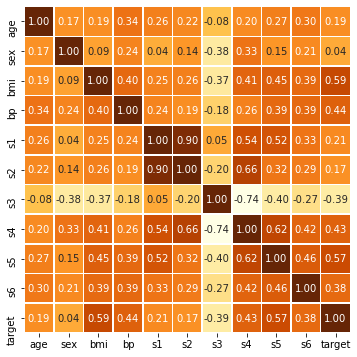

# Linear Regression 

[](https://GitHub.com/Naereen/) 


### Import Library Required
Library yang digunakan adalah **pandas, numpy, matplotlib, seaborn, dan sklearn**. Silahkan install terlebih dahulu jika belum menginstallnya dengan perintah `pip install nama-library`.


```python
%matplotlib inline
import numpy as np
import matplotlib.pyplot as plt
import pandas as pd
import seaborn as sns

from sklearn.model_selection import train_test_split
from sklearn.linear_model import LinearRegression
from sklearn.datasets import load_diabetes
from sklearn.metrics import r2_score
```

### Load Data
Data yang digunakan adalah data bawaan sklearn library. Jika ingin menggunakan data sendiri silahkan pakai perintah `pd.read_csv()` atau `pd.read_excel()`


```python
data = load_diabetes(as_frame=True)
X = data.data
y = data.target
data.frame
```


<div>
<table border="1" class="dataframe">
  <thead>
    <tr style="text-align: right;">
      <th></th>
      <th>age</th>
      <th>sex</th>
      <th>bmi</th>
      <th>bp</th>
      <th>s1</th>
      <th>s2</th>
      <th>s3</th>
      <th>s4</th>
      <th>s5</th>
      <th>s6</th>
      <th>target</th>
    </tr>
  </thead>
  <tbody>
    <tr>
      <th>0</th>
      <td>0.038076</td>
      <td>0.050680</td>
      <td>0.061696</td>
      <td>0.021872</td>
      <td>-0.044223</td>
      <td>-0.034821</td>
      <td>-0.043401</td>
      <td>-0.002592</td>
      <td>0.019908</td>
      <td>-0.017646</td>
      <td>151.0</td>
    </tr>
    <tr>
      <th>1</th>
      <td>-0.001882</td>
      <td>-0.044642</td>
      <td>-0.051474</td>
      <td>-0.026328</td>
      <td>-0.008449</td>
      <td>-0.019163</td>
      <td>0.074412</td>
      <td>-0.039493</td>
      <td>-0.068330</td>
      <td>-0.092204</td>
      <td>75.0</td>
    </tr>
    <tr>
      <th>2</th>
      <td>0.085299</td>
      <td>0.050680</td>
      <td>0.044451</td>
      <td>-0.005671</td>
      <td>-0.045599</td>
      <td>-0.034194</td>
      <td>-0.032356</td>
      <td>-0.002592</td>
      <td>0.002864</td>
      <td>-0.025930</td>
      <td>141.0</td>
    </tr>
    <tr>
      <th>3</th>
      <td>-0.089063</td>
      <td>-0.044642</td>
      <td>-0.011595</td>
      <td>-0.036656</td>
      <td>0.012191</td>
      <td>0.024991</td>
      <td>-0.036038</td>
      <td>0.034309</td>
      <td>0.022692</td>
      <td>-0.009362</td>
      <td>206.0</td>
    </tr>
    <tr>
      <th>4</th>
      <td>0.005383</td>
      <td>-0.044642</td>
      <td>-0.036385</td>
      <td>0.021872</td>
      <td>0.003935</td>
      <td>0.015596</td>
      <td>0.008142</td>
      <td>-0.002592</td>
      <td>-0.031991</td>
      <td>-0.046641</td>
      <td>135.0</td>
    </tr>
    <tr>
      <th>...</th>
      <td>...</td>
      <td>...</td>
      <td>...</td>
      <td>...</td>
      <td>...</td>
      <td>...</td>
      <td>...</td>
      <td>...</td>
      <td>...</td>
      <td>...</td>
      <td>...</td>
    </tr>
    <tr>
      <th>437</th>
      <td>0.041708</td>
      <td>0.050680</td>
      <td>0.019662</td>
      <td>0.059744</td>
      <td>-0.005697</td>
      <td>-0.002566</td>
      <td>-0.028674</td>
      <td>-0.002592</td>
      <td>0.031193</td>
      <td>0.007207</td>
      <td>178.0</td>
    </tr>
    <tr>
      <th>438</th>
      <td>-0.005515</td>
      <td>0.050680</td>
      <td>-0.015906</td>
      <td>-0.067642</td>
      <td>0.049341</td>
      <td>0.079165</td>
      <td>-0.028674</td>
      <td>0.034309</td>
      <td>-0.018118</td>
      <td>0.044485</td>
      <td>104.0</td>
    </tr>
    <tr>
      <th>439</th>
      <td>0.041708</td>
      <td>0.050680</td>
      <td>-0.015906</td>
      <td>0.017282</td>
      <td>-0.037344</td>
      <td>-0.013840</td>
      <td>-0.024993</td>
      <td>-0.011080</td>
      <td>-0.046879</td>
      <td>0.015491</td>
      <td>132.0</td>
    </tr>
    <tr>
      <th>440</th>
      <td>-0.045472</td>
      <td>-0.044642</td>
      <td>0.039062</td>
      <td>0.001215</td>
      <td>0.016318</td>
      <td>0.015283</td>
      <td>-0.028674</td>
      <td>0.026560</td>
      <td>0.044528</td>
      <td>-0.025930</td>
      <td>220.0</td>
    </tr>
    <tr>
      <th>441</th>
      <td>-0.045472</td>
      <td>-0.044642</td>
      <td>-0.073030</td>
      <td>-0.081414</td>
      <td>0.083740</td>
      <td>0.027809</td>
      <td>0.173816</td>
      <td>-0.039493</td>
      <td>-0.004220</td>
      <td>0.003064</td>
      <td>57.0</td>
    </tr>
  </tbody>
</table>
<p>442 rows × 11 columns</p>
</div>


### Explore Data
#### Make Pair Plot


```python
sns.pairplot(data.frame);
```


### Correlation Plot


```python
plt.figure(figsize=(6,6))
sns.heatmap(data.frame.corr(), annot=True, fmt='.2f', square=True, linewidth=.5, cmap="YlOrBr", cbar=False);
```





### Make Dummy Variabel for Catagorical Data


```python
X = data.data
y = data.target

categorical_column = ['sex']
X = pd.get_dummies(X, columns=categorical_column)
X
```


<div>
<table border="1" class="dataframe">
  <thead>
    <tr style="text-align: right;">
      <th></th>
      <th>age</th>
      <th>bmi</th>
      <th>bp</th>
      <th>s1</th>
      <th>s2</th>
      <th>s3</th>
      <th>s4</th>
      <th>s5</th>
      <th>s6</th>
      <th>sex_-0.044641636506989</th>
      <th>sex_0.0506801187398187</th>
    </tr>
  </thead>
  <tbody>
    <tr>
      <th>0</th>
      <td>0.038076</td>
      <td>0.061696</td>
      <td>0.021872</td>
      <td>-0.044223</td>
      <td>-0.034821</td>
      <td>-0.043401</td>
      <td>-0.002592</td>
      <td>0.019908</td>
      <td>-0.017646</td>
      <td>0</td>
      <td>1</td>
    </tr>
    <tr>
      <th>1</th>
      <td>-0.001882</td>
      <td>-0.051474</td>
      <td>-0.026328</td>
      <td>-0.008449</td>
      <td>-0.019163</td>
      <td>0.074412</td>
      <td>-0.039493</td>
      <td>-0.068330</td>
      <td>-0.092204</td>
      <td>1</td>
      <td>0</td>
    </tr>
    <tr>
      <th>2</th>
      <td>0.085299</td>
      <td>0.044451</td>
      <td>-0.005671</td>
      <td>-0.045599</td>
      <td>-0.034194</td>
      <td>-0.032356</td>
      <td>-0.002592</td>
      <td>0.002864</td>
      <td>-0.025930</td>
      <td>0</td>
      <td>1</td>
    </tr>
    <tr>
      <th>3</th>
      <td>-0.089063</td>
      <td>-0.011595</td>
      <td>-0.036656</td>
      <td>0.012191</td>
      <td>0.024991</td>
      <td>-0.036038</td>
      <td>0.034309</td>
      <td>0.022692</td>
      <td>-0.009362</td>
      <td>1</td>
      <td>0</td>
    </tr>
    <tr>
      <th>4</th>
      <td>0.005383</td>
      <td>-0.036385</td>
      <td>0.021872</td>
      <td>0.003935</td>
      <td>0.015596</td>
      <td>0.008142</td>
      <td>-0.002592</td>
      <td>-0.031991</td>
      <td>-0.046641</td>
      <td>1</td>
      <td>0</td>
    </tr>
    <tr>
      <th>...</th>
      <td>...</td>
      <td>...</td>
      <td>...</td>
      <td>...</td>
      <td>...</td>
      <td>...</td>
      <td>...</td>
      <td>...</td>
      <td>...</td>
      <td>...</td>
      <td>...</td>
    </tr>
    <tr>
      <th>437</th>
      <td>0.041708</td>
      <td>0.019662</td>
      <td>0.059744</td>
      <td>-0.005697</td>
      <td>-0.002566</td>
      <td>-0.028674</td>
      <td>-0.002592</td>
      <td>0.031193</td>
      <td>0.007207</td>
      <td>0</td>
      <td>1</td>
    </tr>
    <tr>
      <th>438</th>
      <td>-0.005515</td>
      <td>-0.015906</td>
      <td>-0.067642</td>
      <td>0.049341</td>
      <td>0.079165</td>
      <td>-0.028674</td>
      <td>0.034309</td>
      <td>-0.018118</td>
      <td>0.044485</td>
      <td>0</td>
      <td>1</td>
    </tr>
    <tr>
      <th>439</th>
      <td>0.041708</td>
      <td>-0.015906</td>
      <td>0.017282</td>
      <td>-0.037344</td>
      <td>-0.013840</td>
      <td>-0.024993</td>
      <td>-0.011080</td>
      <td>-0.046879</td>
      <td>0.015491</td>
      <td>0</td>
      <td>1</td>
    </tr>
    <tr>
      <th>440</th>
      <td>-0.045472</td>
      <td>0.039062</td>
      <td>0.001215</td>
      <td>0.016318</td>
      <td>0.015283</td>
      <td>-0.028674</td>
      <td>0.026560</td>
      <td>0.044528</td>
      <td>-0.025930</td>
      <td>1</td>
      <td>0</td>
    </tr>
    <tr>
      <th>441</th>
      <td>-0.045472</td>
      <td>-0.073030</td>
      <td>-0.081414</td>
      <td>0.083740</td>
      <td>0.027809</td>
      <td>0.173816</td>
      <td>-0.039493</td>
      <td>-0.004220</td>
      <td>0.003064</td>
      <td>1</td>
      <td>0</td>
    </tr>
  </tbody>
</table>
<p>442 rows × 11 columns</p>
</div>


### Make Model


```python
model = LinearRegression()
model.fit(X, y)
model.get_params()
```


    {'copy_X': True, 'fit_intercept': True, 'n_jobs': None, 'normalize': False}


### List of Coefficients


```python
lst = [['Intercept', round(model.intercept_, 3)]]
for label, coef in zip(X.columns, np.round(model.coef_, 3)):
    lst.append([label, coef])
pd.DataFrame(lst, columns=['Feature', 'Estimated coefficients'])
```


<div>
<table border="1" class="dataframe">
  <thead>
    <tr style="text-align: right;">
      <th></th>
      <th>Feature</th>
      <th>Estimated coefficients</th>
    </tr>
  </thead>
  <tbody>
    <tr>
      <th>0</th>
      <td>Intercept</td>
      <td>151.409</td>
    </tr>
    <tr>
      <th>1</th>
      <td>age</td>
      <td>-10.012</td>
    </tr>
    <tr>
      <th>2</th>
      <td>bmi</td>
      <td>519.840</td>
    </tr>
    <tr>
      <th>3</th>
      <td>bp</td>
      <td>324.390</td>
    </tr>
    <tr>
      <th>4</th>
      <td>s1</td>
      <td>-792.184</td>
    </tr>
    <tr>
      <th>5</th>
      <td>s2</td>
      <td>476.746</td>
    </tr>
    <tr>
      <th>6</th>
      <td>s3</td>
      <td>101.045</td>
    </tr>
    <tr>
      <th>7</th>
      <td>s4</td>
      <td>177.064</td>
    </tr>
    <tr>
      <th>8</th>
      <td>s5</td>
      <td>751.279</td>
    </tr>
    <tr>
      <th>9</th>
      <td>s6</td>
      <td>67.625</td>
    </tr>
    <tr>
      <th>10</th>
      <td>sex_-0.044641636506989</td>
      <td>11.430</td>
    </tr>
    <tr>
      <th>11</th>
      <td>sex_0.0506801187398187</td>
      <td>-11.430</td>
    </tr>
  </tbody>
</table>
</div>


### R Square


```python
y_pred = model.predict(X)
print('R2 Score: {}'.format(r2_score(y, y_pred)))
```

    R2 Score: 0.5177494254132934
    

### Error


```python
pd.DataFrame({'True' : y, 
              'Prediction': np.round(y_pred, 3),
              'Error^2' : np.round(np.square(y_pred - y), 3)}).reset_index(drop=True)
```


<div>
<table border="1" class="dataframe">
  <thead>
    <tr style="text-align: right;">
      <th></th>
      <th>True</th>
      <th>Prediction</th>
      <th>Error^2</th>
    </tr>
  </thead>
  <tbody>
    <tr>
      <th>0</th>
      <td>151.0</td>
      <td>206.117</td>
      <td>3037.891</td>
    </tr>
    <tr>
      <th>1</th>
      <td>75.0</td>
      <td>68.072</td>
      <td>47.992</td>
    </tr>
    <tr>
      <th>2</th>
      <td>141.0</td>
      <td>176.884</td>
      <td>1287.666</td>
    </tr>
    <tr>
      <th>3</th>
      <td>206.0</td>
      <td>166.918</td>
      <td>1527.405</td>
    </tr>
    <tr>
      <th>4</th>
      <td>135.0</td>
      <td>128.460</td>
      <td>42.774</td>
    </tr>
    <tr>
      <th>...</th>
      <td>...</td>
      <td>...</td>
      <td>...</td>
    </tr>
    <tr>
      <th>437</th>
      <td>178.0</td>
      <td>193.018</td>
      <td>225.541</td>
    </tr>
    <tr>
      <th>438</th>
      <td>104.0</td>
      <td>101.052</td>
      <td>8.692</td>
    </tr>
    <tr>
      <th>439</th>
      <td>132.0</td>
      <td>121.225</td>
      <td>116.099</td>
    </tr>
    <tr>
      <th>440</th>
      <td>220.0</td>
      <td>211.859</td>
      <td>66.278</td>
    </tr>
    <tr>
      <th>441</th>
      <td>57.0</td>
      <td>53.448</td>
      <td>12.615</td>
    </tr>
  </tbody>
</table>
<p>442 rows × 3 columns</p>
</div>


