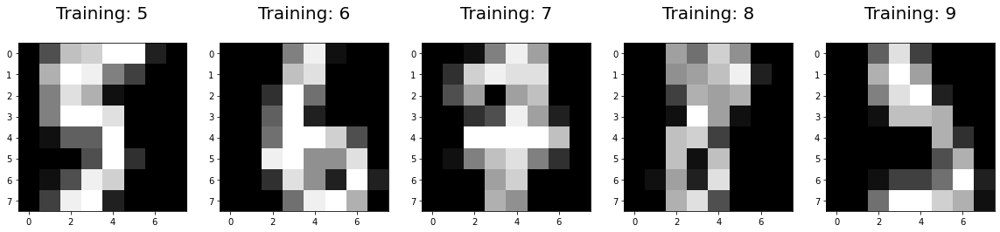
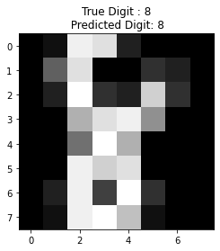
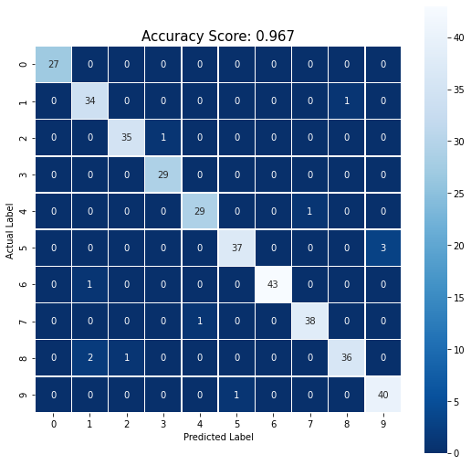

# Logistic Regression 

[](https://GitHub.com/Naereen/) 


### Import library required
Library yang digunakan adalah **pandas, numpy, matplotlib, seaborn, dan sklearn**. Silahkan install terlebih dahulu jika belum menginstallnya dengan perintah `pip install nama-library`.


```python
%matplotlib inline
import numpy as np
import matplotlib.pyplot as plt
import seaborn as sns

from sklearn.datasets import load_digits
from sklearn.linear_model import LogisticRegression
from sklearn.model_selection import train_test_split
from sklearn import metrics
```

### Load Data
Data yang digunakan adalah data bawaan sklearn library. Jika ingin menggunakan data sendiri silahkan pakai perintah `pd.read_csv()` atau `pd.read_excel()`


```python
digits = load_digits()
print(digits.data.shape[0], 'Rows\n', digits.data.shape[1], 'Columns')
```

    1797 Rows
     64 Columns
    

This dataset is made up of 1797 8x8 images. Each image, like the one shown below, is of a hand-written digit. In order to utilize an 8x8 figure like this, we’d have to first transform it into a feature vector with length 64.


```python
plt.figure(figsize=(20,4))

for i, (image, label) in enumerate(zip(digits.data[15:20], digits.target[15:20])):
    plt.subplot(1,5,i+1)
    plt.imshow(np.reshape(image, (8,8)), cmap=plt.cm.gray)
    plt.title('Training: %i\n' % label, fontsize=20)
```





Tujuan dari clasifikasi ini adalah untuk membuat model yang dapat membaca angka pada gambar tersebut.

### Split Data
Fungsi `train_test_split`, secara default akan membagi data menjadi 75% data training dan 25% data test. Untuk mengaturnya dapat menggunakan argument `test_size` atau `train_size`. Contoh `train_test_split(X, y, train_test = 0.8)`


```python
X_train, X_test, y_train, y_test = train_test_split(digits.data, digits.target, random_state=0, test_size=0.20)
print("Jumlah Training Data : ", len(X_train), " | Jumlah Test Data : ", len(X_test))
```

    Jumlah Training Data :  1437  | Jumlah Test Data :  360
    


```python
clf = LogisticRegression()
clf.fit(X_train, y_train)
clf.get_params()
```

    {'C': 1.0,
     'class_weight': None,
     'dual': False,
     'fit_intercept': True,
     'intercept_scaling': 1,
     'l1_ratio': None,
     'max_iter': 100,
     'multi_class': 'auto',
     'n_jobs': None,
     'penalty': 'l2',
     'random_state': None,
     'solver': 'lbfgs',
     'tol': 0.0001,
     'verbose': 0,
     'warm_start': False}


### Test to Predict Data


```python
i = 1
predDigit = clf.predict(X_test[i].reshape(1,-1))[0]

plt.figure()
plt.imshow(X_test[i].reshape(8,8), cmap=plt.cm.gray)
plt.title('True Digit : {}\n Predicted Digit: {}'.format(y_test[i],predDigit));
```





### Check Accuracy 


```python
y_pred = clf.predict(X_test)
accuracy = metrics.accuracy_score(y_test, y_pred)
print("Accuracy : ",accuracy)
```

    Accuracy :  0.9666666666666667
    

### Confusion Matrix


```python
cm = metrics.confusion_matrix(y_test, y_pred)

plt.figure(figsize=(9,9))
sns.heatmap(cm, annot=True, fmt='d', square=True, cmap='Blues_r', linewidth=0.5)

plt.ylabel('Actual Label')
plt.xlabel('Predicted Label')
plt.title('Accuracy Score: {:.3}'.format(accuracy), size=15);
```





### Logistic Regression Pada Data Iris


```python
from sklearn.datasets import load_iris

data = load_iris(as_frame=True)
data.frame
```


<div>
<table border="1" class="dataframe">
  <thead>
    <tr style="text-align: right;">
      <th></th>
      <th>sepal length (cm)</th>
      <th>sepal width (cm)</th>
      <th>petal length (cm)</th>
      <th>petal width (cm)</th>
      <th>target</th>
    </tr>
  </thead>
  <tbody>
    <tr>
      <th>0</th>
      <td>5.1</td>
      <td>3.5</td>
      <td>1.4</td>
      <td>0.2</td>
      <td>0</td>
    </tr>
    <tr>
      <th>1</th>
      <td>4.9</td>
      <td>3.0</td>
      <td>1.4</td>
      <td>0.2</td>
      <td>0</td>
    </tr>
    <tr>
      <th>2</th>
      <td>4.7</td>
      <td>3.2</td>
      <td>1.3</td>
      <td>0.2</td>
      <td>0</td>
    </tr>
    <tr>
      <th>3</th>
      <td>4.6</td>
      <td>3.1</td>
      <td>1.5</td>
      <td>0.2</td>
      <td>0</td>
    </tr>
    <tr>
      <th>4</th>
      <td>5.0</td>
      <td>3.6</td>
      <td>1.4</td>
      <td>0.2</td>
      <td>0</td>
    </tr>
    <tr>
      <th>...</th>
      <td>...</td>
      <td>...</td>
      <td>...</td>
      <td>...</td>
      <td>...</td>
    </tr>
    <tr>
      <th>145</th>
      <td>6.7</td>
      <td>3.0</td>
      <td>5.2</td>
      <td>2.3</td>
      <td>2</td>
    </tr>
    <tr>
      <th>146</th>
      <td>6.3</td>
      <td>2.5</td>
      <td>5.0</td>
      <td>1.9</td>
      <td>2</td>
    </tr>
    <tr>
      <th>147</th>
      <td>6.5</td>
      <td>3.0</td>
      <td>5.2</td>
      <td>2.0</td>
      <td>2</td>
    </tr>
    <tr>
      <th>148</th>
      <td>6.2</td>
      <td>3.4</td>
      <td>5.4</td>
      <td>2.3</td>
      <td>2</td>
    </tr>
    <tr>
      <th>149</th>
      <td>5.9</td>
      <td>3.0</td>
      <td>5.1</td>
      <td>1.8</td>
      <td>2</td>
    </tr>
  </tbody>
</table>
<p>150 rows × 5 columns</p>
</div>


#### Split Data


```python
X = data.data
y = data.target
X_train, X_test, y_train, y_test = train_test_split(X, y, test_size=0.20)
print("Jumlah Training Data : ", len(X_train), " | Jumlah Test Data : ", len(X_test))
```

    Jumlah Training Data :  120  | Jumlah Test Data :  30
    


```python
clf = LogisticRegression()
clf.fit(X_train, y_train)
clf.get_params()
```


    {'C': 1.0,
     'class_weight': None,
     'dual': False,
     'fit_intercept': True,
     'intercept_scaling': 1,
     'l1_ratio': None,
     'max_iter': 100,
     'multi_class': 'auto',
     'n_jobs': None,
     'penalty': 'l2',
     'random_state': None,
     'solver': 'lbfgs',
     'tol': 0.0001,
     'verbose': 0,
     'warm_start': False}


#### Check Accuracy


```python
print('Accuracy: ', clf.score(X_test, y_test))
```

    Accuracy:  1.0
    

#### Make Prediction
Misalnya kita memiliki bunga dengan sepal_length = 0.4, sepal_width = 1, petal_length = 2.3, dan petal_width = 2.5


```python
predict = clf.predict([[0.4,1,2.3,2.5]])
data.target_names[predict][0]
```


    'setosa'


