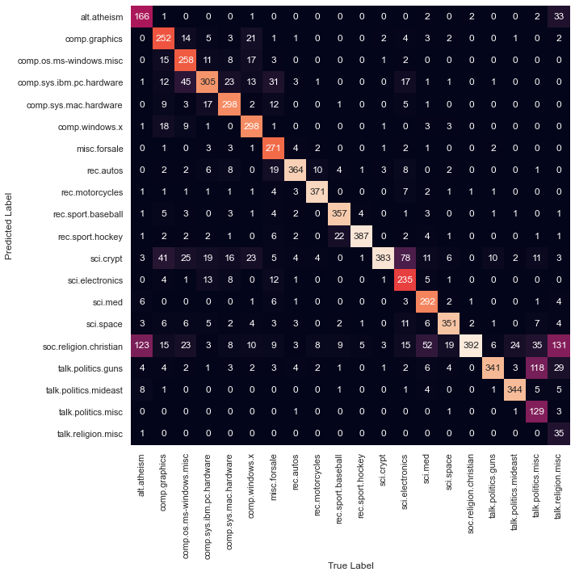

# Naive Bayes Classifier 

[](https://GitHub.com/Naereen/) 


## Text-Classification

### Import library required
Library yang digunakan adalah **pandas, numpy, matplotlib, seaborn, dan sklearn**. Silahkan install terlebih dahulu jika belum menginstallnya dengan perintah `pip install nama-library`.


```python
%matplotlib inline
import numpy as np
import matplotlib.pyplot as plt
import seaborn as sns; sns.set_theme()

from sklearn.feature_extraction.text import TfidfVectorizer
from sklearn.naive_bayes import MultinomialNB
from sklearn.pipeline import make_pipeline
```

### Load Data
Data yang digunakan adalah data bawaan sklearn library. Jika ingin menggunakan data sendiri silahkan pakai perintah `pd.read_csv()` atau `pd.read_excel()`

Data yang digunakan merupakan berita yang telah dikategorikan ke salah satu dari 20 kategori yang ada


```python
from sklearn.datasets import fetch_20newsgroups

data = fetch_20newsgroups()
categories = data.target_names
print('News Catagories: ', categories)
```

    News Catagories:  ['alt.atheism', 'comp.graphics', 'comp.os.ms-windows.misc', 'comp.sys.ibm.pc.hardware', 'comp.sys.mac.hardware', 'comp.windows.x', 'misc.forsale', 'rec.autos', 'rec.motorcycles', 'rec.sport.baseball', 'rec.sport.hockey', 'sci.crypt', 'sci.electronics', 'sci.med', 'sci.space', 'soc.religion.christian', 'talk.politics.guns', 'talk.politics.mideast', 'talk.politics.misc', 'talk.religion.misc']
    

Berikut salah satu contoh textnya :


```python
data.data[5]
```


    'From: dfo@vttoulu.tko.vtt.fi (Foxvog Douglas)\nSubject: Re: Rewording the Second Amendment (ideas)\nOrganization: VTT\nLines: 58\n\nIn article <1r1eu1$4t@transfer.stratus.com> cdt@sw.stratus.com (C. D. Tavares) writes:\n>In article <1993Apr20.083057.16899@ousrvr.oulu.fi>, dfo@vttoulu.tko.vtt.fi (Foxvog Douglas) writes:\n>> In article <1qv87v$4j3@transfer.stratus.com> cdt@sw.stratus.com (C. D. Tavares) writes:\n>> >In article <C5n3GI.F8F@ulowell.ulowell.edu>, jrutledg@cs.ulowell.edu (John Lawrence Rutledge) writes:\n>\n>> >> The massive destructive power of many modern weapons, makes the\n>> >> cost of an accidental or crimial usage of these weapons to great.\n>> >> The weapons of mass destruction need to be in the control of\n>> >> the government only.  Individual access would result in the\n>> >> needless deaths of millions.  This makes the right of the people\n>> >> to keep and bear many modern weapons non-existant.\n\n>> >Thanks for stating where you\'re coming from.  Needless to say, I\n>> >disagree on every count.\n\n>> You believe that individuals should have the right to own weapons of\n>> mass destruction?  I find it hard to believe that you would support a \n>> neighbor\'s right to keep nuclear weapons, biological weapons, and nerve\n>> gas on his/her property.  \n\n>> If we cannot even agree on keeping weapons of mass destruction out of\n>> the hands of individuals, can there be any hope for us?\n\n>I don\'t sign any blank checks.\n\nOf course.  The term must be rigidly defined in any bill.\n\n>When Doug Foxvog says "weapons of mass destruction," he means CBW and\n>nukes.  When Sarah Brady says "weapons of mass destruction" she means\n>Street Sweeper shotguns and semi-automatic SKS rifles.  \n\nI doubt she uses this term for that.  You are using a quote allegedly\nfrom her, can you back it up?\n\n>When John\n>Lawrence Rutledge says "weapons of mass destruction," and then immediately\n>follows it with:\n\n>>> The US has thousands of people killed each year by handguns,\n>>> this number can easily be reduced by putting reasonable restrictions\n>>> on them.\n\n>...what does Rutledge mean by the term?\n\nI read the article as presenting first an argument about weapons of mass\ndestruction (as commonly understood) and then switching to other topics.\nThe first point evidently was to show that not all weapons should be\nallowed, and then the later analysis was, given this understanding, to\nconsider another class.\n\n>cdt@rocket.sw.stratus.com   --If you believe that I speak for my company,\n>OR cdt@vos.stratus.com        write today for my special Investors\' Packet...\n\n\n\n-- \ndoug foxvog\ndouglas.foxvog@vtt.fi\n'


### Split Data


```python
train = fetch_20newsgroups(subset='train', categories=categories)
test = fetch_20newsgroups(subset='test', categories=categories)
print("Jumlah Training Data : ", len(train.data), " | Jumlah Test Data : ", len(test.data))
```

    Jumlah Training Data :  11314  | Jumlah Test Data :  7532
    

#### Make Model 
Before we make model, we convert a collection of raw text to a matrix of TF-IDF features with `TfidfVectorizer`


```python
model = make_pipeline(TfidfVectorizer(), MultinomialNB())
model.fit(train.data, train.target)
model.get_params()
```


    {'memory': None,
     'steps': [('tfidfvectorizer', TfidfVectorizer()),
      ('multinomialnb', MultinomialNB())],
     'verbose': False,
     'tfidfvectorizer': TfidfVectorizer(),
     'multinomialnb': MultinomialNB(),
     'tfidfvectorizer__analyzer': 'word',
     'tfidfvectorizer__binary': False,
     'tfidfvectorizer__decode_error': 'strict',
     'tfidfvectorizer__dtype': numpy.float64,
     'tfidfvectorizer__encoding': 'utf-8',
     'tfidfvectorizer__input': 'content',
     'tfidfvectorizer__lowercase': True,
     'tfidfvectorizer__max_df': 1.0,
     'tfidfvectorizer__max_features': None,
     'tfidfvectorizer__min_df': 1,
     'tfidfvectorizer__ngram_range': (1, 1),
     'tfidfvectorizer__norm': 'l2',
     'tfidfvectorizer__preprocessor': None,
     'tfidfvectorizer__smooth_idf': True,
     'tfidfvectorizer__stop_words': None,
     'tfidfvectorizer__strip_accents': None,
     'tfidfvectorizer__sublinear_tf': False,
     'tfidfvectorizer__token_pattern': '(?u)\\b\\w\\w+\\b',
     'tfidfvectorizer__tokenizer': None,
     'tfidfvectorizer__use_idf': True,
     'tfidfvectorizer__vocabulary': None,
     'multinomialnb__alpha': 1.0,
     'multinomialnb__class_prior': None,
     'multinomialnb__fit_prior': True}


### Predict Test Data


```python
labels = model.predict(test.data)
labels
```


    array([ 7, 11,  0, ...,  9,  3, 15], dtype=int64)


#### Make Confusion Matrix


```python
from sklearn.metrics import confusion_matrix
mat = confusion_matrix(test.target, labels)

fig, ax = plt.subplots(figsize=(10,10)) 
sns.heatmap(mat.T, square=True, annot=True, fmt='d', cbar=False,
           xticklabels=train.target_names, 
           yticklabels=train.target_names)

plt.xlabel('True Label')
plt.ylabel('Predicted Label');
```





#### Make Function to Catagorize New News


```python
def predicted_catagory(s, train=train, model=model):
    pred = model.predict([s])
    return train.target_names[pred[0]]

predicted_catagory('Indonesian Politics is messy')
```


    'talk.politics.mideast'


#### Check Accuracy Model


```python
print('Accuracy : ',model.score(test.data, test.target))
```

    Accuracy :  0.7738980350504514
    

## Implementation in Iris Data

#### Import Library and Load Data


```python
from sklearn.datasets import load_iris
from sklearn.model_selection import train_test_split
from sklearn.naive_bayes import GaussianNB
import pandas as pd

iris = load_iris(as_frame = True)
X, y = (iris.data, iris.target)
iris.frame
```


<div>
<table border="1" class="dataframe">
  <thead>
    <tr style="text-align: right;">
      <th></th>
      <th>sepal length (cm)</th>
      <th>sepal width (cm)</th>
      <th>petal length (cm)</th>
      <th>petal width (cm)</th>
      <th>target</th>
    </tr>
  </thead>
  <tbody>
    <tr>
      <th>0</th>
      <td>5.1</td>
      <td>3.5</td>
      <td>1.4</td>
      <td>0.2</td>
      <td>0</td>
    </tr>
    <tr>
      <th>1</th>
      <td>4.9</td>
      <td>3.0</td>
      <td>1.4</td>
      <td>0.2</td>
      <td>0</td>
    </tr>
    <tr>
      <th>2</th>
      <td>4.7</td>
      <td>3.2</td>
      <td>1.3</td>
      <td>0.2</td>
      <td>0</td>
    </tr>
    <tr>
      <th>3</th>
      <td>4.6</td>
      <td>3.1</td>
      <td>1.5</td>
      <td>0.2</td>
      <td>0</td>
    </tr>
    <tr>
      <th>4</th>
      <td>5.0</td>
      <td>3.6</td>
      <td>1.4</td>
      <td>0.2</td>
      <td>0</td>
    </tr>
    <tr>
      <th>...</th>
      <td>...</td>
      <td>...</td>
      <td>...</td>
      <td>...</td>
      <td>...</td>
    </tr>
    <tr>
      <th>145</th>
      <td>6.7</td>
      <td>3.0</td>
      <td>5.2</td>
      <td>2.3</td>
      <td>2</td>
    </tr>
    <tr>
      <th>146</th>
      <td>6.3</td>
      <td>2.5</td>
      <td>5.0</td>
      <td>1.9</td>
      <td>2</td>
    </tr>
    <tr>
      <th>147</th>
      <td>6.5</td>
      <td>3.0</td>
      <td>5.2</td>
      <td>2.0</td>
      <td>2</td>
    </tr>
    <tr>
      <th>148</th>
      <td>6.2</td>
      <td>3.4</td>
      <td>5.4</td>
      <td>2.3</td>
      <td>2</td>
    </tr>
    <tr>
      <th>149</th>
      <td>5.9</td>
      <td>3.0</td>
      <td>5.1</td>
      <td>1.8</td>
      <td>2</td>
    </tr>
  </tbody>
</table>
<p>150 rows × 5 columns</p>
</div>


#### Split Data


```python
X_train, X_test, y_train, y_test = train_test_split(X,y, random_state=0)
print("Jumlah Training Data : ", len(X_train), " | Jumlah Test Data : ", len(X_test))
```

    Jumlah Training Data :  112  | Jumlah Test Data :  38
    

#### Make Model


```python
clf = GaussianNB()
clf.fit(X_train, y_train)
clf.get_params()
```


    {'priors': None, 'var_smoothing': 1e-09}


#### Predict Test Data


```python
y_pred = clf.predict(X_test)
print(pd.DataFrame({'Prediction Label' : iris.target_names[y_pred],
              'Actual Label': iris.target_names[y_test]}))
```

       Prediction Label Actual Label
    0         virginica    virginica
    1        versicolor   versicolor
    2            setosa       setosa
    3         virginica    virginica
    4            setosa       setosa
    5         virginica    virginica
    6            setosa       setosa
    7        versicolor   versicolor
    8        versicolor   versicolor
    9        versicolor   versicolor
    10        virginica    virginica
    11       versicolor   versicolor
    12       versicolor   versicolor
    13       versicolor   versicolor
    14       versicolor   versicolor
    15           setosa       setosa
    16       versicolor   versicolor
    17       versicolor   versicolor
    18           setosa       setosa
    19           setosa       setosa
    20        virginica    virginica
    21       versicolor   versicolor
    22           setosa       setosa
    23           setosa       setosa
    24        virginica    virginica
    25           setosa       setosa
    26           setosa       setosa
    27       versicolor   versicolor
    28       versicolor   versicolor
    29           setosa       setosa
    30        virginica    virginica
    31       versicolor   versicolor
    32           setosa       setosa
    33        virginica    virginica
    34        virginica    virginica
    35       versicolor   versicolor
    36           setosa       setosa
    37       versicolor   versicolor
    

#### Check Accuracy


```python
print('Accuracy: ',clf.score(X_train, y_train))
```

    Accuracy:  0.9464285714285714
    

#### Confusion Matrix


```python
from sklearn.metrics import confusion_matrix
cm = confusion_matrix(y_test, y_pred)

fig, ax = plt.subplots(figsize=(5,5)) 
sns.heatmap(cm.T, square=True, annot=True, fmt='d', cbar=False,
           xticklabels=iris.target_names, 
           yticklabels=iris.target_names)

plt.xlabel('True Label')
plt.ylabel('Predicted Label');
```


#### Predict New Data
Misalnya kita memiliki bunga dengan sepal_length = 0.4, sepal_width = 1, petal_length = 2.3, dan petal_width = 2.5


```python
predict = clf.predict([[0.4,1,2.3,2.5]])
iris.target_names[predict][0]
```


    'virginica'


