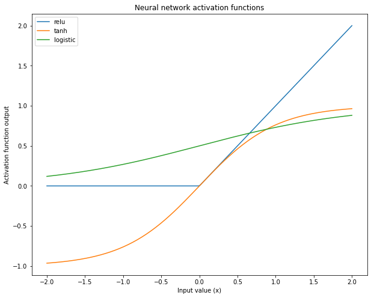
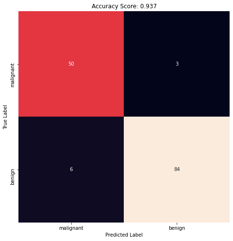

# Neural Network  
[](https://GitHub.com/Naereen/) 


### Import library required
Library yang digunakan adalah **pandas, numpy, matplotlib, seaborn, dan sklearn**. Silahkan install terlebih dahulu jika belum menginstallnya dengan perintah `pip install nama-library`.


```python
%matplotlib inline
import numpy as np
import pandas as pd
import seaborn as sns
import matplotlib.pyplot as plt

from sklearn.model_selection import train_test_split
from sklearn.datasets import load_breast_cancer
from sklearn.neural_network import MLPClassifier
from sklearn.preprocessing import MinMaxScaler
from sklearn.metrics import confusion_matrix
```

### Activation Function
Berikut beberapa activation function yang sering digunakan pada neural network


```python
xrange = np.linspace(-2, 2, 200)

plt.figure(figsize=(10, 8))

plt.plot(xrange, np.maximum(xrange, 0), label = 'relu')
plt.plot(xrange, np.tanh(xrange), label = 'tanh')
plt.plot(xrange, 1 / (1 + np.exp(-xrange)), label = 'logistic')
plt.legend()
plt.title('Neural network activation functions')
plt.xlabel('Input value (x)')
plt.ylabel('Activation function output');
```





### Load Data
Data yang digunakan adalah data bawaan sklearn library. Jika ingin menggunakan data sendiri silahkan pakai perintah `pd.read_csv()` atau `pd.read_excel()`


```python
data = load_breast_cancer(as_frame= True)
X_cancer = data.data
y_cancer = data.target
data.frame
```


<div>
<table border="1" class="dataframe">
  <thead>
    <tr style="text-align: right;">
      <th></th>
      <th>mean radius</th>
      <th>mean texture</th>
      <th>mean perimeter</th>
      <th>mean area</th>
      <th>mean smoothness</th>
      <th>mean compactness</th>
      <th>mean concavity</th>
      <th>mean concave points</th>
      <th>mean symmetry</th>
      <th>mean fractal dimension</th>
      <th>...</th>
      <th>worst texture</th>
      <th>worst perimeter</th>
      <th>worst area</th>
      <th>worst smoothness</th>
      <th>worst compactness</th>
      <th>worst concavity</th>
      <th>worst concave points</th>
      <th>worst symmetry</th>
      <th>worst fractal dimension</th>
      <th>target</th>
    </tr>
  </thead>
  <tbody>
    <tr>
      <th>0</th>
      <td>17.99</td>
      <td>10.38</td>
      <td>122.80</td>
      <td>1001.0</td>
      <td>0.11840</td>
      <td>0.27760</td>
      <td>0.30010</td>
      <td>0.14710</td>
      <td>0.2419</td>
      <td>0.07871</td>
      <td>...</td>
      <td>17.33</td>
      <td>184.60</td>
      <td>2019.0</td>
      <td>0.16220</td>
      <td>0.66560</td>
      <td>0.7119</td>
      <td>0.2654</td>
      <td>0.4601</td>
      <td>0.11890</td>
      <td>0</td>
    </tr>
    <tr>
      <th>1</th>
      <td>20.57</td>
      <td>17.77</td>
      <td>132.90</td>
      <td>1326.0</td>
      <td>0.08474</td>
      <td>0.07864</td>
      <td>0.08690</td>
      <td>0.07017</td>
      <td>0.1812</td>
      <td>0.05667</td>
      <td>...</td>
      <td>23.41</td>
      <td>158.80</td>
      <td>1956.0</td>
      <td>0.12380</td>
      <td>0.18660</td>
      <td>0.2416</td>
      <td>0.1860</td>
      <td>0.2750</td>
      <td>0.08902</td>
      <td>0</td>
    </tr>
    <tr>
      <th>2</th>
      <td>19.69</td>
      <td>21.25</td>
      <td>130.00</td>
      <td>1203.0</td>
      <td>0.10960</td>
      <td>0.15990</td>
      <td>0.19740</td>
      <td>0.12790</td>
      <td>0.2069</td>
      <td>0.05999</td>
      <td>...</td>
      <td>25.53</td>
      <td>152.50</td>
      <td>1709.0</td>
      <td>0.14440</td>
      <td>0.42450</td>
      <td>0.4504</td>
      <td>0.2430</td>
      <td>0.3613</td>
      <td>0.08758</td>
      <td>0</td>
    </tr>
    <tr>
      <th>3</th>
      <td>11.42</td>
      <td>20.38</td>
      <td>77.58</td>
      <td>386.1</td>
      <td>0.14250</td>
      <td>0.28390</td>
      <td>0.24140</td>
      <td>0.10520</td>
      <td>0.2597</td>
      <td>0.09744</td>
      <td>...</td>
      <td>26.50</td>
      <td>98.87</td>
      <td>567.7</td>
      <td>0.20980</td>
      <td>0.86630</td>
      <td>0.6869</td>
      <td>0.2575</td>
      <td>0.6638</td>
      <td>0.17300</td>
      <td>0</td>
    </tr>
    <tr>
      <th>4</th>
      <td>20.29</td>
      <td>14.34</td>
      <td>135.10</td>
      <td>1297.0</td>
      <td>0.10030</td>
      <td>0.13280</td>
      <td>0.19800</td>
      <td>0.10430</td>
      <td>0.1809</td>
      <td>0.05883</td>
      <td>...</td>
      <td>16.67</td>
      <td>152.20</td>
      <td>1575.0</td>
      <td>0.13740</td>
      <td>0.20500</td>
      <td>0.4000</td>
      <td>0.1625</td>
      <td>0.2364</td>
      <td>0.07678</td>
      <td>0</td>
    </tr>
    <tr>
      <th>...</th>
      <td>...</td>
      <td>...</td>
      <td>...</td>
      <td>...</td>
      <td>...</td>
      <td>...</td>
      <td>...</td>
      <td>...</td>
      <td>...</td>
      <td>...</td>
      <td>...</td>
      <td>...</td>
      <td>...</td>
      <td>...</td>
      <td>...</td>
      <td>...</td>
      <td>...</td>
      <td>...</td>
      <td>...</td>
      <td>...</td>
      <td>...</td>
    </tr>
    <tr>
      <th>564</th>
      <td>21.56</td>
      <td>22.39</td>
      <td>142.00</td>
      <td>1479.0</td>
      <td>0.11100</td>
      <td>0.11590</td>
      <td>0.24390</td>
      <td>0.13890</td>
      <td>0.1726</td>
      <td>0.05623</td>
      <td>...</td>
      <td>26.40</td>
      <td>166.10</td>
      <td>2027.0</td>
      <td>0.14100</td>
      <td>0.21130</td>
      <td>0.4107</td>
      <td>0.2216</td>
      <td>0.2060</td>
      <td>0.07115</td>
      <td>0</td>
    </tr>
    <tr>
      <th>565</th>
      <td>20.13</td>
      <td>28.25</td>
      <td>131.20</td>
      <td>1261.0</td>
      <td>0.09780</td>
      <td>0.10340</td>
      <td>0.14400</td>
      <td>0.09791</td>
      <td>0.1752</td>
      <td>0.05533</td>
      <td>...</td>
      <td>38.25</td>
      <td>155.00</td>
      <td>1731.0</td>
      <td>0.11660</td>
      <td>0.19220</td>
      <td>0.3215</td>
      <td>0.1628</td>
      <td>0.2572</td>
      <td>0.06637</td>
      <td>0</td>
    </tr>
    <tr>
      <th>566</th>
      <td>16.60</td>
      <td>28.08</td>
      <td>108.30</td>
      <td>858.1</td>
      <td>0.08455</td>
      <td>0.10230</td>
      <td>0.09251</td>
      <td>0.05302</td>
      <td>0.1590</td>
      <td>0.05648</td>
      <td>...</td>
      <td>34.12</td>
      <td>126.70</td>
      <td>1124.0</td>
      <td>0.11390</td>
      <td>0.30940</td>
      <td>0.3403</td>
      <td>0.1418</td>
      <td>0.2218</td>
      <td>0.07820</td>
      <td>0</td>
    </tr>
    <tr>
      <th>567</th>
      <td>20.60</td>
      <td>29.33</td>
      <td>140.10</td>
      <td>1265.0</td>
      <td>0.11780</td>
      <td>0.27700</td>
      <td>0.35140</td>
      <td>0.15200</td>
      <td>0.2397</td>
      <td>0.07016</td>
      <td>...</td>
      <td>39.42</td>
      <td>184.60</td>
      <td>1821.0</td>
      <td>0.16500</td>
      <td>0.86810</td>
      <td>0.9387</td>
      <td>0.2650</td>
      <td>0.4087</td>
      <td>0.12400</td>
      <td>0</td>
    </tr>
    <tr>
      <th>568</th>
      <td>7.76</td>
      <td>24.54</td>
      <td>47.92</td>
      <td>181.0</td>
      <td>0.05263</td>
      <td>0.04362</td>
      <td>0.00000</td>
      <td>0.00000</td>
      <td>0.1587</td>
      <td>0.05884</td>
      <td>...</td>
      <td>30.37</td>
      <td>59.16</td>
      <td>268.6</td>
      <td>0.08996</td>
      <td>0.06444</td>
      <td>0.0000</td>
      <td>0.0000</td>
      <td>0.2871</td>
      <td>0.07039</td>
      <td>1</td>
    </tr>
  </tbody>
</table>
<p>569 rows × 31 columns</p>
</div>


### Split Data
Fungsi `train_test_split`, secara default akan membagi data menjadi 75% data training dan 25% data test. Untuk mengaturnya dapat menggunakan argument `test_size` atau `train_size`. Contoh `train_test_split(X, y, train_test = 0.8)`


```python
X_train, X_test, y_train, y_test = train_test_split(X_cancer, y_cancer, random_state = 0)
print("Jumlah Training Data : ", len(X_train), " | Jumlah Test Data : ", len(X_test))
```

    Jumlah Training Data :  426  | Jumlah Test Data :  143
    

### Transformasi Data
Hal ini dilakukan untuk mengurangi komputasi


```python
scaler = MinMaxScaler()
X_train_scaled = scaler.fit_transform(X_train)
X_test_scaled = scaler.transform(X_test)
X_test_scaled
```


    array([[0.30380046, 0.44854772, 0.30993021, ..., 0.70651051, 0.39818648,
            0.36639118],
           [0.29480808, 0.64481328, 0.27855711, ..., 0.20685498, 0.17327025,
            0.08421881],
           [0.33314402, 0.24688797, 0.31649506, ..., 0.28301757, 0.11255667,
            0.07910272],
           ...,
           [0.25363245, 0.10622407, 0.24289959, ..., 0.36858422, 0.30455352,
            0.13695396],
           [0.30995314, 0.05103734, 0.30488563, ..., 0.25514984, 0.22570471,
            0.11065197],
           [0.59676274, 0.35020747, 0.60058047, ..., 0.77402687, 0.40961955,
            0.24393283]])


### Make Model
Untuk mengatur jumlah layer dapat diatur menggunakan parameter `hidden_layer_sizes`. Sebagai contoh `hidden_layer_sizes = [8, 20]` berarti model yang dibuat akan menggunakan 2 hidden layer, dimana layer 1 memiliki 8 black box dan layer 2 memiliki 20 black box.
Activation function dapat di atur menggunakan parameter `activation`. Parameter tersebut dapat bernilai **relu, logistic, tanh, dan identity**
Untuk melihat parameter apa saja yang dapat diatur dapat menggunakan fungsi `help(MLPClassifier)`


```python
layer_size = [8, 20]
activation_function = "relu"

clf = MLPClassifier(hidden_layer_sizes = layer_size, random_state = 0, activation = activation_function, solver = "lbfgs")
clf.fit(X_train_scaled, y_train)
clf.get_params()
```


    {'activation': 'relu',
     'alpha': 0.0001,
     'batch_size': 'auto',
     'beta_1': 0.9,
     'beta_2': 0.999,
     'early_stopping': False,
     'epsilon': 1e-08,
     'hidden_layer_sizes': [8, 20],
     'learning_rate': 'constant',
     'learning_rate_init': 0.001,
     'max_fun': 15000,
     'max_iter': 200,
     'momentum': 0.9,
     'n_iter_no_change': 10,
     'nesterovs_momentum': True,
     'power_t': 0.5,
     'random_state': 0,
     'shuffle': True,
     'solver': 'lbfgs',
     'tol': 0.0001,
     'validation_fraction': 0.1,
     'verbose': False,
     'warm_start': False}


### Check Accuracy


```python
print('Breast cancer dataset')
print('Accuracy of NN classifier on training set: {:.2f}'
     .format(clf.score(X_train_scaled, y_train)))
print('Accuracy of NN classifier on test set: {:.2f}'
     .format(clf.score(X_test_scaled, y_test)))
```

    Breast cancer dataset
    Accuracy of NN classifier on training set: 1.00
    Accuracy of NN classifier on test set: 0.94
    

### Predict Test Data


```python
y_pred = clf.predict(X_test_scaled)
data.target_names[y_pred]
```


    array(['malignant', 'benign', 'benign', 'benign', 'benign', 'benign',
           'benign', 'benign', 'benign', 'benign', 'benign', 'benign',
           'benign', 'malignant', 'benign', 'malignant', 'benign',
           'malignant', 'malignant', 'malignant', 'malignant', 'malignant',
           'benign', 'benign', 'malignant', 'benign', 'benign', 'malignant',
           'benign', 'malignant', 'benign', 'malignant', 'benign',
           'malignant', 'benign', 'malignant', 'benign', 'malignant',
           'benign', 'malignant', 'malignant', 'benign', 'malignant',
           'benign', 'benign', 'malignant', 'benign', 'benign', 'benign',
           'malignant', 'malignant', 'benign', 'malignant', 'benign',
           'benign', 'benign', 'benign', 'benign', 'benign', 'malignant',
           'malignant', 'malignant', 'benign', 'benign', 'malignant',
           'benign', 'malignant', 'malignant', 'malignant', 'benign',
           'malignant', 'malignant', 'benign', 'malignant', 'malignant',
           'benign', 'benign', 'benign', 'benign', 'benign', 'malignant',
           'malignant', 'malignant', 'benign', 'malignant', 'benign',
           'benign', 'benign', 'malignant', 'malignant', 'benign',
           'malignant', 'malignant', 'malignant', 'benign', 'benign',
           'malignant', 'benign', 'benign', 'benign', 'benign', 'benign',
           'benign', 'benign', 'malignant', 'benign', 'malignant', 'benign',
           'malignant', 'benign', 'benign', 'malignant', 'malignant',
           'benign', 'benign', 'benign', 'benign', 'benign', 'benign',
           'benign', 'malignant', 'benign', 'benign', 'benign', 'malignant',
           'benign', 'malignant', 'benign', 'benign', 'benign', 'malignant',
           'benign', 'benign', 'benign', 'benign', 'benign', 'malignant',
           'malignant', 'malignant', 'benign', 'benign', 'benign',
           'malignant'], dtype='<U9')


### Confusion Matrix


```python
cm = confusion_matrix(y_test, y_pred)
plt.figure(figsize=(8,8))
sns.heatmap(cm, annot=True, square=True, cbar=False, xticklabels=data.target_names, yticklabels=data.target_names)

plt.xlabel('Predicted Label')
plt.ylabel('True Label')
plt.title('Accuracy Score: {:.3}'.format(clf.score(X_test_scaled, y_test)));
```




