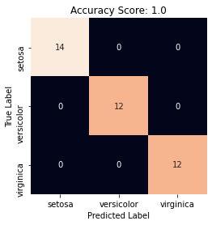

# Random Forest Classifier 

[](https://GitHub.com/Naereen/) 


### Import library required
Library yang digunakan adalah **pandas, numpy, matplotlib, seaborn, dan sklearn**. Silahkan install terlebih dahulu jika belum menginstallnya dengan perintah `pip install nama-library`.


```python
%matplotlib inline
import pandas as pd
import matplotlib.pyplot as plt
import seaborn as sns

from sklearn.datasets import load_iris
from sklearn.ensemble import RandomForestClassifier
from sklearn.model_selection import train_test_split
from sklearn.metrics import confusion_matrix
from sklearn.metrics import accuracy_score
```

### Load Data
Data yang digunakan adalah data bawaan sklearn library. Jika ingin menggunakan data sendiri silahkan pakai perintah `pd.read_csv()` atau `pd.read_excel()`


```python
data = load_iris(as_frame=True)
X = data.data
y = data.target
data.data.assign(spacies=data.target_names[y])
```


<div>
<table border="1" class="dataframe">
  <thead>
    <tr style="text-align: right;">
      <th></th>
      <th>sepal length (cm)</th>
      <th>sepal width (cm)</th>
      <th>petal length (cm)</th>
      <th>petal width (cm)</th>
      <th>spacies</th>
    </tr>
  </thead>
  <tbody>
    <tr>
      <th>0</th>
      <td>5.1</td>
      <td>3.5</td>
      <td>1.4</td>
      <td>0.2</td>
      <td>setosa</td>
    </tr>
    <tr>
      <th>1</th>
      <td>4.9</td>
      <td>3.0</td>
      <td>1.4</td>
      <td>0.2</td>
      <td>setosa</td>
    </tr>
    <tr>
      <th>2</th>
      <td>4.7</td>
      <td>3.2</td>
      <td>1.3</td>
      <td>0.2</td>
      <td>setosa</td>
    </tr>
    <tr>
      <th>3</th>
      <td>4.6</td>
      <td>3.1</td>
      <td>1.5</td>
      <td>0.2</td>
      <td>setosa</td>
    </tr>
    <tr>
      <th>4</th>
      <td>5.0</td>
      <td>3.6</td>
      <td>1.4</td>
      <td>0.2</td>
      <td>setosa</td>
    </tr>
    <tr>
      <th>...</th>
      <td>...</td>
      <td>...</td>
      <td>...</td>
      <td>...</td>
      <td>...</td>
    </tr>
    <tr>
      <th>145</th>
      <td>6.7</td>
      <td>3.0</td>
      <td>5.2</td>
      <td>2.3</td>
      <td>virginica</td>
    </tr>
    <tr>
      <th>146</th>
      <td>6.3</td>
      <td>2.5</td>
      <td>5.0</td>
      <td>1.9</td>
      <td>virginica</td>
    </tr>
    <tr>
      <th>147</th>
      <td>6.5</td>
      <td>3.0</td>
      <td>5.2</td>
      <td>2.0</td>
      <td>virginica</td>
    </tr>
    <tr>
      <th>148</th>
      <td>6.2</td>
      <td>3.4</td>
      <td>5.4</td>
      <td>2.3</td>
      <td>virginica</td>
    </tr>
    <tr>
      <th>149</th>
      <td>5.9</td>
      <td>3.0</td>
      <td>5.1</td>
      <td>1.8</td>
      <td>virginica</td>
    </tr>
  </tbody>
</table>
<p>150 rows × 5 columns</p>
</div>


### Split Data
Fungsi `train_test_split`, secara default akan membagi data menjadi 75% data training dan 25% data test. Untuk mengaturnya dapat menggunakan argument `test_size` atau `train_size`. Contoh `train_test_split(X, y, train_test = 0.8)`


```python
X_train, X_test, y_train, y_test = train_test_split(X,y)
print("Jumlah Training Data : ", len(X_train), " | Jumlah Test Data : ", len(X_test))
```

    Jumlah Training Data :  112  | Jumlah Test Data :  38
    

### Make Model
Secara default jumlah tree yang digunakan adalah 100. Untuk mengaturnya dapat mnggunakan parameter `n_estimators`. Untuk melihat parameter apa saja yang dapat diubah jalankan perintah ini `help(RandomForestClassifier)`


```python
clf = RandomForestClassifier(random_state=0)
clf.fit(X_train, y_train)
clf.get_params()
```


    {'bootstrap': True,
     'ccp_alpha': 0.0,
     'class_weight': None,
     'criterion': 'gini',
     'max_depth': None,
     'max_features': 'auto',
     'max_leaf_nodes': None,
     'max_samples': None,
     'min_impurity_decrease': 0.0,
     'min_impurity_split': None,
     'min_samples_leaf': 1,
     'min_samples_split': 2,
     'min_weight_fraction_leaf': 0.0,
     'n_estimators': 100,
     'n_jobs': None,
     'oob_score': False,
     'random_state': 0,
     'verbose': 0,
     'warm_start': False}


### Predict Test Data


```python
y_pred = clf.predict(X_test)
X_test.assign(true_spacies=data.target_names[y_test], predicted_species=data.target_names[y_pred])
```


<div>
<table border="1" class="dataframe">
  <thead>
    <tr style="text-align: right;">
      <th></th>
      <th>sepal length (cm)</th>
      <th>sepal width (cm)</th>
      <th>petal length (cm)</th>
      <th>petal width (cm)</th>
      <th>true_spacies</th>
      <th>predicted_species</th>
    </tr>
  </thead>
  <tbody>
    <tr>
      <th>116</th>
      <td>6.5</td>
      <td>3.0</td>
      <td>5.5</td>
      <td>1.8</td>
      <td>virginica</td>
      <td>virginica</td>
    </tr>
    <tr>
      <th>65</th>
      <td>6.7</td>
      <td>3.1</td>
      <td>4.4</td>
      <td>1.4</td>
      <td>versicolor</td>
      <td>versicolor</td>
    </tr>
    <tr>
      <th>0</th>
      <td>5.1</td>
      <td>3.5</td>
      <td>1.4</td>
      <td>0.2</td>
      <td>setosa</td>
      <td>setosa</td>
    </tr>
    <tr>
      <th>31</th>
      <td>5.4</td>
      <td>3.4</td>
      <td>1.5</td>
      <td>0.4</td>
      <td>setosa</td>
      <td>setosa</td>
    </tr>
    <tr>
      <th>125</th>
      <td>7.2</td>
      <td>3.2</td>
      <td>6.0</td>
      <td>1.8</td>
      <td>virginica</td>
      <td>virginica</td>
    </tr>
    <tr>
      <th>96</th>
      <td>5.7</td>
      <td>2.9</td>
      <td>4.2</td>
      <td>1.3</td>
      <td>versicolor</td>
      <td>versicolor</td>
    </tr>
    <tr>
      <th>69</th>
      <td>5.6</td>
      <td>2.5</td>
      <td>3.9</td>
      <td>1.1</td>
      <td>versicolor</td>
      <td>versicolor</td>
    </tr>
    <tr>
      <th>15</th>
      <td>5.7</td>
      <td>4.4</td>
      <td>1.5</td>
      <td>0.4</td>
      <td>setosa</td>
      <td>setosa</td>
    </tr>
    <tr>
      <th>127</th>
      <td>6.1</td>
      <td>3.0</td>
      <td>4.9</td>
      <td>1.8</td>
      <td>virginica</td>
      <td>virginica</td>
    </tr>
    <tr>
      <th>81</th>
      <td>5.5</td>
      <td>2.4</td>
      <td>3.7</td>
      <td>1.0</td>
      <td>versicolor</td>
      <td>versicolor</td>
    </tr>
    <tr>
      <th>93</th>
      <td>5.0</td>
      <td>2.3</td>
      <td>3.3</td>
      <td>1.0</td>
      <td>versicolor</td>
      <td>versicolor</td>
    </tr>
    <tr>
      <th>138</th>
      <td>6.0</td>
      <td>3.0</td>
      <td>4.8</td>
      <td>1.8</td>
      <td>virginica</td>
      <td>virginica</td>
    </tr>
    <tr>
      <th>97</th>
      <td>6.2</td>
      <td>2.9</td>
      <td>4.3</td>
      <td>1.3</td>
      <td>versicolor</td>
      <td>versicolor</td>
    </tr>
    <tr>
      <th>26</th>
      <td>5.0</td>
      <td>3.4</td>
      <td>1.6</td>
      <td>0.4</td>
      <td>setosa</td>
      <td>setosa</td>
    </tr>
    <tr>
      <th>112</th>
      <td>6.8</td>
      <td>3.0</td>
      <td>5.5</td>
      <td>2.1</td>
      <td>virginica</td>
      <td>virginica</td>
    </tr>
    <tr>
      <th>48</th>
      <td>5.3</td>
      <td>3.7</td>
      <td>1.5</td>
      <td>0.2</td>
      <td>setosa</td>
      <td>setosa</td>
    </tr>
    <tr>
      <th>74</th>
      <td>6.4</td>
      <td>2.9</td>
      <td>4.3</td>
      <td>1.3</td>
      <td>versicolor</td>
      <td>versicolor</td>
    </tr>
    <tr>
      <th>25</th>
      <td>5.0</td>
      <td>3.0</td>
      <td>1.6</td>
      <td>0.2</td>
      <td>setosa</td>
      <td>setosa</td>
    </tr>
    <tr>
      <th>64</th>
      <td>5.6</td>
      <td>2.9</td>
      <td>3.6</td>
      <td>1.3</td>
      <td>versicolor</td>
      <td>versicolor</td>
    </tr>
    <tr>
      <th>140</th>
      <td>6.7</td>
      <td>3.1</td>
      <td>5.6</td>
      <td>2.4</td>
      <td>virginica</td>
      <td>virginica</td>
    </tr>
    <tr>
      <th>67</th>
      <td>5.8</td>
      <td>2.7</td>
      <td>4.1</td>
      <td>1.0</td>
      <td>versicolor</td>
      <td>versicolor</td>
    </tr>
    <tr>
      <th>89</th>
      <td>5.5</td>
      <td>2.5</td>
      <td>4.0</td>
      <td>1.3</td>
      <td>versicolor</td>
      <td>versicolor</td>
    </tr>
    <tr>
      <th>47</th>
      <td>4.6</td>
      <td>3.2</td>
      <td>1.4</td>
      <td>0.2</td>
      <td>setosa</td>
      <td>setosa</td>
    </tr>
    <tr>
      <th>143</th>
      <td>6.8</td>
      <td>3.2</td>
      <td>5.9</td>
      <td>2.3</td>
      <td>virginica</td>
      <td>virginica</td>
    </tr>
    <tr>
      <th>5</th>
      <td>5.4</td>
      <td>3.9</td>
      <td>1.7</td>
      <td>0.4</td>
      <td>setosa</td>
      <td>setosa</td>
    </tr>
    <tr>
      <th>2</th>
      <td>4.7</td>
      <td>3.2</td>
      <td>1.3</td>
      <td>0.2</td>
      <td>setosa</td>
      <td>setosa</td>
    </tr>
    <tr>
      <th>82</th>
      <td>5.8</td>
      <td>2.7</td>
      <td>3.9</td>
      <td>1.2</td>
      <td>versicolor</td>
      <td>versicolor</td>
    </tr>
    <tr>
      <th>18</th>
      <td>5.7</td>
      <td>3.8</td>
      <td>1.7</td>
      <td>0.3</td>
      <td>setosa</td>
      <td>setosa</td>
    </tr>
    <tr>
      <th>149</th>
      <td>5.9</td>
      <td>3.0</td>
      <td>5.1</td>
      <td>1.8</td>
      <td>virginica</td>
      <td>virginica</td>
    </tr>
    <tr>
      <th>19</th>
      <td>5.1</td>
      <td>3.8</td>
      <td>1.5</td>
      <td>0.3</td>
      <td>setosa</td>
      <td>setosa</td>
    </tr>
    <tr>
      <th>58</th>
      <td>6.6</td>
      <td>2.9</td>
      <td>4.6</td>
      <td>1.3</td>
      <td>versicolor</td>
      <td>versicolor</td>
    </tr>
    <tr>
      <th>29</th>
      <td>4.7</td>
      <td>3.2</td>
      <td>1.6</td>
      <td>0.2</td>
      <td>setosa</td>
      <td>setosa</td>
    </tr>
    <tr>
      <th>114</th>
      <td>5.8</td>
      <td>2.8</td>
      <td>5.1</td>
      <td>2.4</td>
      <td>virginica</td>
      <td>virginica</td>
    </tr>
    <tr>
      <th>141</th>
      <td>6.9</td>
      <td>3.1</td>
      <td>5.1</td>
      <td>2.3</td>
      <td>virginica</td>
      <td>virginica</td>
    </tr>
    <tr>
      <th>115</th>
      <td>6.4</td>
      <td>3.2</td>
      <td>5.3</td>
      <td>2.3</td>
      <td>virginica</td>
      <td>virginica</td>
    </tr>
    <tr>
      <th>8</th>
      <td>4.4</td>
      <td>2.9</td>
      <td>1.4</td>
      <td>0.2</td>
      <td>setosa</td>
      <td>setosa</td>
    </tr>
    <tr>
      <th>30</th>
      <td>4.8</td>
      <td>3.1</td>
      <td>1.6</td>
      <td>0.2</td>
      <td>setosa</td>
      <td>setosa</td>
    </tr>
    <tr>
      <th>128</th>
      <td>6.4</td>
      <td>2.8</td>
      <td>5.6</td>
      <td>2.1</td>
      <td>virginica</td>
      <td>virginica</td>
    </tr>
  </tbody>
</table>
</div>


### Predicted Probability


```python
clf.predict_proba(X_test)
```


    array([[0.  , 0.  , 1.  ],
           [0.  , 1.  , 0.  ],
           [1.  , 0.  , 0.  ],
           [0.99, 0.01, 0.  ],
           [0.  , 0.04, 0.96],
           [0.  , 1.  , 0.  ],
           [0.  , 1.  , 0.  ],
           [0.96, 0.04, 0.  ],
           [0.  , 0.15, 0.85],
           [0.  , 1.  , 0.  ],
           [0.  , 0.97, 0.03],
           [0.  , 0.43, 0.57],
           [0.  , 0.99, 0.01],
           [1.  , 0.  , 0.  ],
           [0.  , 0.  , 1.  ],
           [1.  , 0.  , 0.  ],
           [0.  , 0.99, 0.01],
           [1.  , 0.  , 0.  ],
           [0.  , 1.  , 0.  ],
           [0.  , 0.  , 1.  ],
           [0.  , 1.  , 0.  ],
           [0.  , 1.  , 0.  ],
           [1.  , 0.  , 0.  ],
           [0.  , 0.01, 0.99],
           [1.  , 0.  , 0.  ],
           [1.  , 0.  , 0.  ],
           [0.  , 1.  , 0.  ],
           [0.96, 0.04, 0.  ],
           [0.  , 0.14, 0.86],
           [1.  , 0.  , 0.  ],
           [0.  , 0.99, 0.01],
           [1.  , 0.  , 0.  ],
           [0.  , 0.02, 0.98],
           [0.  , 0.02, 0.98],
           [0.  , 0.01, 0.99],
           [1.  , 0.  , 0.  ],
           [1.  , 0.  , 0.  ],
           [0.  , 0.  , 1.  ]])


### Check Accuracy


```python
accuracy = accuracy_score(y_test, y_pred)
print("Accuracy : ", accuracy)
```

    Accuracy :  1.0
    

### Confusion Matrix


```python
cm = confusion_matrix(y_test, y_pred)

plt.figure()
sns.heatmap(cm, annot=True, square=True, cbar=False, xticklabels=data.target_names, yticklabels=data.target_names)

plt.xlabel('Predicted Label')
plt.ylabel('True Label')
plt.title('Accuracy Score: {:.3}'.format(accuracy));
```





#### Make Prediction
Misalnya kita memiliki bunga dengan sepal_length = 0.4, sepal_width = 1, petal_length = 2.3, dan petal_width = 2.5


```python
predict = clf.predict([[0.4,1,2.3,2.5]])
data.target_names[predict][0]
```


    'setosa'


