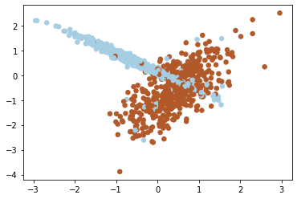
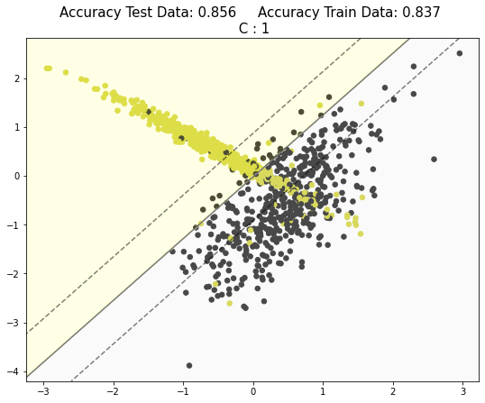
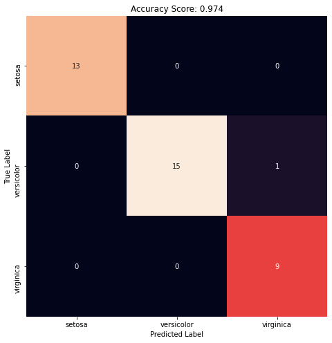

# Support Vector Machine 

[](https://GitHub.com/Naereen/) 


## Linear Support Vector Machine

### Import library required
Library yang digunakan adalah **pandas, numpy, matplotlib, seaborn, dan sklearn**. Silahkan install terlebih dahulu jika belum menginstallnya dengan perintah `pip install nama-library`.


```python
%matplotlib inline
import numpy as np
import matplotlib.pyplot as plt

from matplotlib.colors import ListedColormap
from sklearn.svm import SVC
from sklearn.datasets import make_blobs, make_classification
from sklearn.model_selection import train_test_split
```

### Make Fake Data


```python
# X, y = make_blobs(n_samples=100, centers=3, random_state=20)
X, y = make_classification(n_samples = 1000, n_features=2,
                                n_redundant=0, n_informative=2,
                                n_clusters_per_class=1, flip_y = 0.1,
                                class_sep = 0.5, n_classes=2)

plt.scatter(X[:,0], X[:, 1], s=30, c=y, cmap=plt.cm.Paired);
```





### Make Function to Plot Decision Boundaries
This function just working for `n_features = 2`


```python
def make_plot(clf, X, y):
    X_train, X_test, y_train, y_test = train_test_split(X, y, random_state=0)
    clf.fit(X_train, y_train)
    
    numClasses = np.amax(y) + 1
    color_list_light = ['#FFFFAA', '#EFEFEF', '#AAFFAA', '#AAAAFF']
    color_list_bold = ['#cfcf1f', '#000000', '#00CC00', '#0000CC']
    cmap_bold  = ListedColormap(color_list_bold[0:numClasses])
    cmap_light = ListedColormap(color_list_light[0:numClasses])

    plt.figure(figsize=(9,7))
    
    plt.scatter(X[:,0], X[:, 1], s=30, c=y, cmap=cmap_bold)
    
    ax = plt.gca()
    xlim = ax.get_xlim()
    ylim = ax.get_ylim()

    xx = np.arange(xlim[0], xlim[1], 0.03)
    yy = np.arange(ylim[0], ylim[1], 0.03)

    XX, YY = np.meshgrid(xx, yy)
    xy = np.c_[XX.ravel(), YY.ravel()]

    P = clf.predict(xy).reshape(XX.shape)
    ax.contourf(XX,YY,P, cmap=cmap_light, alpha=0.3);
    
    if numClasses == 2:
        Z = clf.decision_function(xy).reshape(XX.shape)
        ax.contour(XX,YY,Z, colors='k', alpha=0.5, levels=([-1,0,1]), linestyles=['--', '-', '--'])
    else:
        ax.contour(XX,YY,P, colors='k', alpha=0.5, linestyles='--')
    
    accuracy_test = clf.score(X_test, y_test)
    accuracy_train = clf.score(X_train, y_train)
    C = clf.get_params()['C']
    plt.title('Accuracy Test Data: {:.3}     Accuracy Train Data: {:.3} \n C : {}'.format(
        accuracy_test, accuracy_train, C), size=15)
```

### Make Model


```python
clf = SVC(kernel='linear', C=1)
make_plot(clf, X, y)
```





## Application to Iris Dataset

### Load Library and Data


```python
from sklearn.datasets import load_iris
from sklearn.metrics import confusion_matrix
from sklearn.metrics import accuracy_score
import seaborn as sns

data = load_iris(as_frame = True)
X = data.data
y = data.target
data.frame
```


<div>
<table border="1" class="dataframe">
  <thead>
    <tr style="text-align: right;">
      <th></th>
      <th>sepal length (cm)</th>
      <th>sepal width (cm)</th>
      <th>petal length (cm)</th>
      <th>petal width (cm)</th>
      <th>target</th>
    </tr>
  </thead>
  <tbody>
    <tr>
      <th>0</th>
      <td>5.1</td>
      <td>3.5</td>
      <td>1.4</td>
      <td>0.2</td>
      <td>0</td>
    </tr>
    <tr>
      <th>1</th>
      <td>4.9</td>
      <td>3.0</td>
      <td>1.4</td>
      <td>0.2</td>
      <td>0</td>
    </tr>
    <tr>
      <th>2</th>
      <td>4.7</td>
      <td>3.2</td>
      <td>1.3</td>
      <td>0.2</td>
      <td>0</td>
    </tr>
    <tr>
      <th>3</th>
      <td>4.6</td>
      <td>3.1</td>
      <td>1.5</td>
      <td>0.2</td>
      <td>0</td>
    </tr>
    <tr>
      <th>4</th>
      <td>5.0</td>
      <td>3.6</td>
      <td>1.4</td>
      <td>0.2</td>
      <td>0</td>
    </tr>
    <tr>
      <th>...</th>
      <td>...</td>
      <td>...</td>
      <td>...</td>
      <td>...</td>
      <td>...</td>
    </tr>
    <tr>
      <th>145</th>
      <td>6.7</td>
      <td>3.0</td>
      <td>5.2</td>
      <td>2.3</td>
      <td>2</td>
    </tr>
    <tr>
      <th>146</th>
      <td>6.3</td>
      <td>2.5</td>
      <td>5.0</td>
      <td>1.9</td>
      <td>2</td>
    </tr>
    <tr>
      <th>147</th>
      <td>6.5</td>
      <td>3.0</td>
      <td>5.2</td>
      <td>2.0</td>
      <td>2</td>
    </tr>
    <tr>
      <th>148</th>
      <td>6.2</td>
      <td>3.4</td>
      <td>5.4</td>
      <td>2.3</td>
      <td>2</td>
    </tr>
    <tr>
      <th>149</th>
      <td>5.9</td>
      <td>3.0</td>
      <td>5.1</td>
      <td>1.8</td>
      <td>2</td>
    </tr>
  </tbody>
</table>
<p>150 rows × 5 columns</p>
</div>


### Split Data
Fungsi `train_test_split`, secara default akan membagi data menjadi 75% data training dan 25% data test. Untuk mengaturnya dapat menggunakan argument `test_size` atau `train_size`. Contoh `train_test_split(X, y, train_test = 0.8)`


```python
X_train, X_test, y_train, y_test = train_test_split(X, y, random_state=0)
print("Jumlah Training Data : ", len(X_train), " | Jumlah Test Data : ", len(X_test))
```

    Jumlah Training Data :  112  | Jumlah Test Data :  38
    

### Make Model


```python
clf = SVC(kernel='linear', C=1)
clf.fit(X_train,y_train)
clf.get_params()
```


    {'C': 1,
     'break_ties': False,
     'cache_size': 200,
     'class_weight': None,
     'coef0': 0.0,
     'decision_function_shape': 'ovr',
     'degree': 3,
     'gamma': 'scale',
     'kernel': 'linear',
     'max_iter': -1,
     'probability': False,
     'random_state': None,
     'shrinking': True,
     'tol': 0.001,
     'verbose': False}


### Check Accuracy


```python
y_pred = clf.predict(X_test)
accuracy = accuracy_score(y_test, y_pred)
print('Accuracy : ', accuracy)
```

    Accuracy :  0.9736842105263158
    

### Confusion Matrix


```python
cm = confusion_matrix(y_test, y_pred)

plt.figure(figsize=(8,8))
sns.heatmap(cm, annot=True, square=True, cbar=False, xticklabels=data.target_names, yticklabels=data.target_names)

plt.xlabel('Predicted Label')
plt.ylabel('True Label')
plt.title('Accuracy Score: {:.3}'.format(accuracy));
```





#### Make Prediction
Misalnya kita memiliki bunga dengan sepal_length = 0.4, sepal_width = 1, petal_length = 2.3, dan petal_width = 2.5


```python
predict = clf.predict([[0.4,1,2.3,2.5]])
data.target_names[predict][0]
```


    'virginica'


