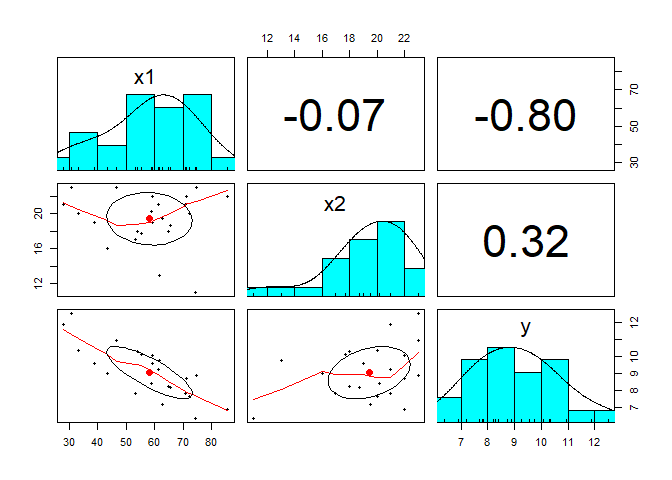

# Regresi Linear  

[](https://GitHub.com/Naereen/)

### Load Library

Library yang dibutuhkan adalah **psych**. Silahkan install terlebih
dahulu jika belum terisntall, dengan perintah `install.packages("psych")`

``` r
library(psych)
```

### Baca data

Data tersimpan di folder `dataset`

``` r
data<- read.csv("../dataset/anareg.csv", header = TRUE, sep = ";")
head(data)
```

    ##     x1   x2     y
    ## 1 58.8 20.2  8.40
    ## 2 70.7 21.0  7.82
    ## 3 28.1 21.0 11.88
    ## 4 46.8 23.0 10.94
    ## 5 59.3 22.0 10.09
    ## 6 74.5 23.0  8.88

### Membuat Pair Plot

Terlihat dari data bahwa tidak ada korelasi yang berarti antar variabel

``` r
pairs.panels(data)
```



### Konversi Data

Jika data belum bertipe **numeric**, maka konversi terlebih dahulu

``` r
for(i in names(data)){
  data[ ,i]=as.numeric(data[ ,i])
}
str(data)
```

    ## 'data.frame':    24 obs. of  3 variables:
    ##  $ x1: num  58.8 70.7 28.1 46.8 59.3 74.5 61.4 33.4 59.3 72.1 ...
    ##  $ x2: num  20.2 21 21 23 22 23 21 20 19 20 ...
    ##  $ y : num  8.4 7.82 11.88 10.94 10.09 ...

### Membuat Model Regresi

``` r
modelreg<-lm(y~., data=data)
summary(modelreg)
```

    ## 
    ## Call:
    ## lm(formula = y ~ ., data = data)
    ## 
    ## Residuals:
    ##     Min      1Q  Median      3Q     Max 
    ## -1.4851 -0.5219 -0.1263  0.6396  1.8282 
    ## 
    ## Coefficients:
    ##             Estimate Std. Error t value Pr(>|t|)    
    ## (Intercept) 11.06105    1.40532   7.871 1.07e-07 ***
    ## x1          -0.07993    0.01198  -6.670 1.33e-06 ***
    ## x2           0.13651    0.05965   2.289   0.0326 *  
    ## ---
    ## Signif. codes:  0 '***' 0.001 '**' 0.01 '*' 0.05 '.' 0.1 ' ' 1
    ## 
    ## Residual standard error: 0.8564 on 21 degrees of freedom
    ## Multiple R-squared:  0.7131, Adjusted R-squared:  0.6857 
    ## F-statistic: 26.09 on 2 and 21 DF,  p-value: 2.026e-06

### Koefisien Regresi

``` r
coefficients(modelreg)
```

    ## (Intercept)          x1          x2 
    ## 11.06104870 -0.07993291  0.13650523
