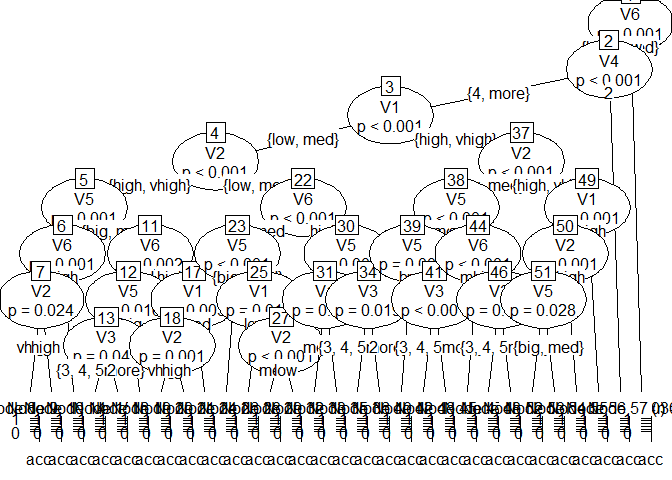
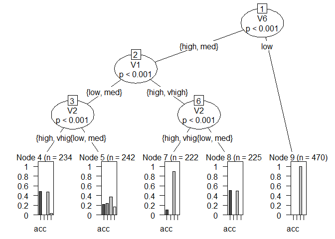

# Decision Tree  

[](https://GitHub.com/Naereen/) 

### Load Library

Tiga library yang dibutuhkan, yaitu **party, psych, dan caret**. Jika
belum terinstall, silahkan install terlebih dahulu dengan perintah
`install.packages("nama-package")`.

Library **party** akan digunakan untuk membuat visualisasi dari decision
tree. Library **psych** akan digunakan untuk melihat korelasi antar
variabel. Library **caret** digunakan untuk membuat confusion matriks
dan melihar akurasi model.

``` r
library(party)
library(psych)
library(caret)
```

### Baca Data

Data tersimpan di folder `dataset`

``` r
car <- read.csv("../dataset/car.txt", header=FALSE)
head(car)
```

    ##      V1    V2 V3 V4    V5   V6    V7
    ## 1 vhigh vhigh  2  2 small  low unacc
    ## 2 vhigh vhigh  2  2 small  med unacc
    ## 3 vhigh vhigh  2  2 small high unacc
    ## 4 vhigh vhigh  2  2   med  low unacc
    ## 5 vhigh vhigh  2  2   med  med unacc
    ## 6 vhigh vhigh  2  2   med high unacc

Deskripsi data car bisa diliat di file car\_info\_var, V7 merupakan
target class yaitu car acceptance

### Konversi Data

Ubah tipe variabel menjadi tipe faktor

``` r
for(i in names(car)){
  car[,i]= as.factor(car[,i])
}
str(car)
```

    ## 'data.frame':    1728 obs. of  7 variables:
    ##  $ V1: Factor w/ 4 levels "high","low","med",..: 4 4 4 4 4 4 4 4 4 4 ...
    ##  $ V2: Factor w/ 4 levels "high","low","med",..: 4 4 4 4 4 4 4 4 4 4 ...
    ##  $ V3: Factor w/ 4 levels "2","3","4","5more": 1 1 1 1 1 1 1 1 1 1 ...
    ##  $ V4: Factor w/ 3 levels "2","4","more": 1 1 1 1 1 1 1 1 1 2 ...
    ##  $ V5: Factor w/ 3 levels "big","med","small": 3 3 3 2 2 2 1 1 1 3 ...
    ##  $ V6: Factor w/ 3 levels "high","low","med": 2 3 1 2 3 1 2 3 1 2 ...
    ##  $ V7: Factor w/ 4 levels "acc","good","unacc",..: 3 3 3 3 3 3 3 3 3 3 ...

### Split Data

Memecah data menjadi data training (80% dari data awal) dan data test
(20% dari data awal)

``` r
set.seed(1234)
sampel <- sample(2,nrow(car),replace = T, prob = c(0.8,0.2))
trainingdat <- car[sampel==1, ]
testingdat <- car[sampel==2, ]
print(paste("Jumlah train data :", nrow(trainingdat)))
```

    ## [1] "Jumlah train data : 1393"

``` r
print(paste("Jumlah test data :", nrow(testingdat)))
```

    ## [1] "Jumlah test data : 335"

### Membuat Model

Misal kita ingin menggunakan semua atributnya

``` r
pohonnya <- ctree(V7~., data=trainingdat)
plot(pohonnya)
```



Jika dirasa cukup berantakan, filter tampilan tree dengan cuma nampilin
variabel atau banyak observasi tertentu, ini dinamakan **pruning tree**

``` r
pohondahdifilter <- ctree(V7~V1+V2+V6, data=trainingdat, 
                          controls = ctree_control(mincriterion = 0.99, minsplit = 300))
plot(pohondahdifilter)
```


*mincriterion* artinya kita mecah node apabila, dengan taraf
signifikansi 99 persen, variabel tersebut signifikan. makin tinggi
mincriterion makin sederhana pohonnya. *minsplit* artinya pohonnya bakal
bercabang kalo observasi dari node tersebut minimal 300 biji. makin
besar minsplitnya, makin sederhana pohonnya.

### Model Evaluation

#### Sebelum dilakukan prunning

``` r
prediksi <- predict(pohonnya, testingdat)
confusionMatrix(table(prediksi,testingdat$V7))
```

    ## Confusion Matrix and Statistics
    ## 
    ##         
    ## prediksi acc good unacc vgood
    ##    acc    68    3     7     0
    ##    good    2    7     0     4
    ##    unacc   9    0   222     0
    ##    vgood   0    1     0    12
    ## 
    ## Overall Statistics
    ##                                           
    ##                Accuracy : 0.9224          
    ##                  95% CI : (0.8883, 0.9487)
    ##     No Information Rate : 0.6836          
    ##     P-Value [Acc > NIR] : < 2.2e-16       
    ##                                           
    ##                   Kappa : 0.8351          
    ##                                           
    ##  Mcnemar's Test P-Value : NA              
    ## 
    ## Statistics by Class:
    ## 
    ##                      Class: acc Class: good Class: unacc Class: vgood
    ## Sensitivity              0.8608     0.63636       0.9694      0.75000
    ## Specificity              0.9609     0.98148       0.9151      0.99687
    ## Pos Pred Value           0.8718     0.53846       0.9610      0.92308
    ## Neg Pred Value           0.9572     0.98758       0.9327      0.98758
    ## Prevalence               0.2358     0.03284       0.6836      0.04776
    ## Detection Rate           0.2030     0.02090       0.6627      0.03582
    ## Detection Prevalence     0.2328     0.03881       0.6896      0.03881
    ## Balanced Accuracy        0.9108     0.80892       0.9423      0.87343

#### Setelah dilakukan prunning

``` r
prediksi2 <- predict(pohondahdifilter, testingdat)
confusionMatrix(table(prediksi2, testingdat$V7))
```

    ## Confusion Matrix and Statistics
    ## 
    ##          
    ## prediksi2 acc good unacc vgood
    ##     acc    57    0    56     4
    ##     good    0    0     0     0
    ##     unacc  22   11   173    12
    ##     vgood   0    0     0     0
    ## 
    ## Overall Statistics
    ##                                           
    ##                Accuracy : 0.6866          
    ##                  95% CI : (0.6339, 0.7359)
    ##     No Information Rate : 0.6836          
    ##     P-Value [Acc > NIR] : 0.4794          
    ##                                           
    ##                   Kappa : 0.3371          
    ##                                           
    ##  Mcnemar's Test P-Value : NA              
    ## 
    ## Statistics by Class:
    ## 
    ##                      Class: acc Class: good Class: unacc Class: vgood
    ## Sensitivity              0.7215     0.00000       0.7555      0.00000
    ## Specificity              0.7656     1.00000       0.5755      1.00000
    ## Pos Pred Value           0.4872         NaN       0.7936          NaN
    ## Neg Pred Value           0.8991     0.96716       0.5214      0.95224
    ## Prevalence               0.2358     0.03284       0.6836      0.04776
    ## Detection Rate           0.1701     0.00000       0.5164      0.00000
    ## Detection Prevalence     0.3493     0.00000       0.6507      0.00000
    ## Balanced Accuracy        0.7436     0.50000       0.6655      0.50000

Terlihat bahwa dari akurasi kedua model, pohon yang disederhanakan
memiliki akurasi yang lebih rendah daripada pohon yang tidak
disederhanakan.