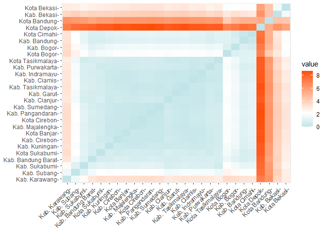
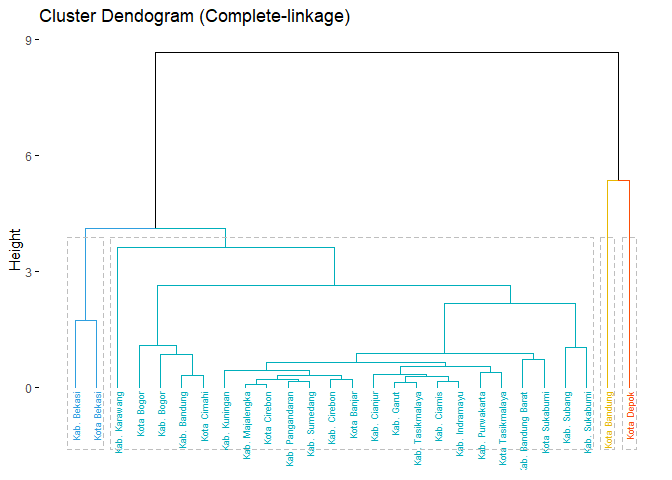
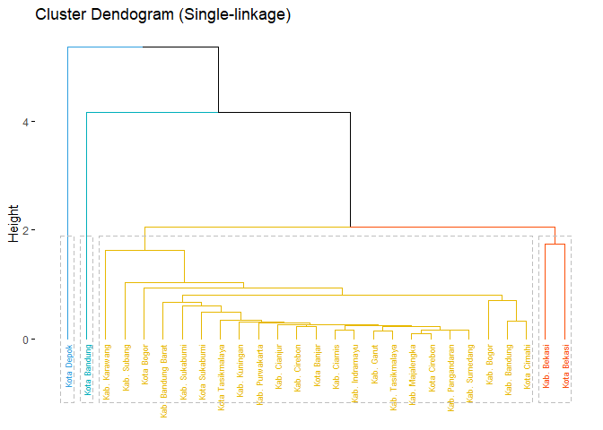

# Hierarchical Clustering  

[](https://GitHub.com/Naereen/) 

### Load library

Enam library yang dibutuhkan, yaitu **readxl, dplyr, cluster,
factoextra, NbClust**. Jika belum terinstall, silahkan install terlebih
dahulu dengan perintah `install.packages("nama-package")`.

``` r
library(readxl) # import file excel
library(dplyr) # menggunakan pipe operator
library(cluster)  # analisis cluster
library(factoextra) # EDA, untuk membuat distance matriks
library(NbClust) # menentukan jumlah cluster
```

### Baca Data

Data tersimpan di folder `dataset`

``` r
data <- read_xlsx("../dataset/jabar-2mei.xlsx") %>% 
        as.data.frame()
head(data)
```

    ##              regency odp pdp positive_active positive_cure positive_dead
    ## 1       Kab. Bandung 112  38              30             6             4
    ## 2 Kab. Bandung Barat 199  10              28             0             3
    ## 3        Kab. Bekasi 539 132              30            30             7
    ## 4         Kab. Bogor 146  55              69             5             4
    ## 5        Kab. Ciamis 141  23               2             2             0
    ## 6       Kab. Cianjur 225  33               2             0             1

### Mengganti Row Names

Nama kab/kota dijadikan row index. Kemudian kolom nama kab/kota
dikeluarkan

``` r
row.names(data) <- data$regency 
data <- data[,-1]               
head(data)                
```

    ##                    odp pdp positive_active positive_cure positive_dead
    ## Kab. Bandung       112  38              30             6             4
    ## Kab. Bandung Barat 199  10              28             0             3
    ## Kab. Bekasi        539 132              30            30             7
    ## Kab. Bogor         146  55              69             5             4
    ## Kab. Ciamis        141  23               2             2             0
    ## Kab. Cianjur       225  33               2             0             1

### Distance metric

``` r
d1 <- get_dist(data, stand = TRUE, method = "euclidean")
d1
```

    ##                    Kab. Bandung Kab. Bandung Barat Kab. Bekasi Kab. Bogor
    ## Kab. Bandung Barat    0.7946488                                          
    ## Kab. Bekasi           3.1704929          3.8557494                       
    ## Kab. Bogor            0.8733179          1.1432207   3.3462690           
    ## Kab. Ciamis           1.0223677          0.8036554   3.8103401  1.6583623
    ## Kab. Cianjur          1.0992470          0.6768293   3.9279958  1.6754019
    ## Kab. Cirebon          1.0520960          0.8876388   3.9039645  1.6956934
    ## Kab. Garut            1.1448052          0.7035623   4.0219710  1.6910599
    ## Kab. Indramayu        1.0698861          0.7724680   3.8888556  1.6598394
    ## Kab. Karawang         3.2771800          3.1931708   3.6866354  3.4813267
    ## Kab. Kuningan         0.9206909          0.6889519   3.8491027  1.5868012
    ## Kab. Majalengka       1.1057050          0.7411905   4.0533435  1.7209538
    ## Kab. Pangandaran      1.2062711          0.8740711   4.1328224  1.7940259
    ## Kab. Purwakarta       0.8509350          0.8089843   3.5741967  1.4930583
    ## Kab. Subang           2.1428279          1.7671149   3.9628599  2.3487906
    ## Kab. Sukabumi         1.3152444          1.0099127   3.6520892  1.7253127
    ## Kab. Sumedang         1.1275615          0.7511073   4.0885909  1.6717437
    ## Kab. Tasikmalaya      1.1972698          0.8000266   4.0646556  1.7859519
    ## Kota Bandung          5.1975236          5.6477189   4.4652674  4.8932199
    ## Kota Banjar           1.0902889          0.8672808   3.9624770  1.6964876
    ## Kota Bekasi           2.2760640          2.8064893   1.7345035  2.1651910
    ## Kota Bogor            1.0824603          1.5538461   3.0183884  0.9251228
    ## Kota Cimahi           0.3224327          0.9211376   3.0536352  0.7020407
    ## Kota Cirebon          1.1093563          0.7705750   4.0805602  1.7179205
    ## Kota Depok            7.7084377          8.0428830   6.3332270  7.2562817
    ## Kota Sukabumi         0.8138698          0.7369476   3.7631900  1.2699779
    ## Kota Tasikmalaya      1.0742587          0.7629351   3.7618356  1.6509054
    ##                    Kab. Ciamis Kab. Cianjur Kab. Cirebon Kab. Garut
    ## Kab. Bandung Barat                                                 
    ## Kab. Bekasi                                                        
    ## Kab. Bogor                                                         
    ## Kab. Ciamis                                                        
    ## Kab. Cianjur         0.3587089                                     
    ## Kab. Cirebon         0.2862593    0.5751532                        
    ## Kab. Garut           0.2829981    0.2805973    0.4286538           
    ## Kab. Indramayu       0.1596918    0.2635998    0.3763758  0.2473585
    ## Kab. Karawang        3.1597539    3.0360746    3.4320662  3.1635146
    ## Kab. Kuningan        0.3854346    0.3858063    0.4231232  0.4622717
    ## Kab. Majalengka      0.3574434    0.4136789    0.3114524  0.3053599
    ## Kab. Pangandaran     0.3984227    0.5502007    0.2501311  0.3665218
    ## Kab. Purwakarta      0.2914459    0.5654609    0.4265930  0.4961497
    ## Kab. Subang          1.8903270    1.6774008    2.1566165  1.7918690
    ## Kab. Sukabumi        0.8926948    0.7538858    1.1705077  0.8630345
    ## Kab. Sumedang        0.3573654    0.4877678    0.2789741  0.2781911
    ## Kab. Tasikmalaya     0.2791491    0.3433084    0.3536688  0.1475453
    ## Kota Bandung         6.1552268    6.0872416    6.2119626  6.2376589
    ## Kota Banjar          0.2847629    0.4805486    0.2255992  0.4007465
    ## Kota Bekasi          2.9165568    2.9555559    3.0682233  3.0721095
    ## Kota Bogor           2.0450085    2.0153390    2.0837249  2.1220336
    ## Kota Cimahi          1.1476236    1.2407132    1.2036884  1.2672656
    ## Kota Cirebon         0.4159796    0.5066899    0.2948338  0.3830889
    ## Kota Depok           8.3639001    8.2821652    8.5369273  8.4494712
    ## Kota Sukabumi        0.6000211    0.8208202    0.5196456  0.6657407
    ## Kota Tasikmalaya     0.3463701    0.3746225    0.5954813  0.3428040
    ##                    Kab. Indramayu Kab. Karawang Kab. Kuningan Kab. Majalengka
    ## Kab. Bandung Barat                                                           
    ## Kab. Bekasi                                                                  
    ## Kab. Bogor                                                                   
    ## Kab. Ciamis                                                                  
    ## Kab. Cianjur                                                                 
    ## Kab. Cirebon                                                                 
    ## Kab. Garut                                                                   
    ## Kab. Indramayu                                                               
    ## Kab. Karawang           3.1536873                                            
    ## Kab. Kuningan           0.3632507     3.3239577                              
    ## Kab. Majalengka         0.3607190     3.3982052     0.3088275                
    ## Kab. Pangandaran        0.4168917     3.5029472     0.4578924       0.1986441
    ## Kab. Purwakarta         0.4090150     3.0815202     0.5577591       0.5827489
    ## Kab. Subang             1.8509088     1.6170160     2.0126422       2.0368466
    ## Kab. Sukabumi           0.8608299     2.3252795     1.0720646       1.1172365
    ## Kab. Sumedang           0.3592118     3.4274137     0.4427724       0.2115055
    ## Kab. Tasikmalaya        0.2724610     3.2562481     0.4375337       0.2201852
    ## Kota Bandung            6.1608455     6.3497152     5.9417133       6.1849851
    ## Kota Banjar             0.2701961     3.4133311     0.3425515       0.3079376
    ## Kota Bekasi             2.9389893     2.8708718     2.9551587       3.1744705
    ## Kota Bogor              2.0510280     3.6323953     1.8487963       2.0714617
    ## Kota Cimahi             1.1912520     3.1831882     1.1279298       1.2902762
    ## Kota Cirebon            0.4283922     3.4919505     0.3449910       0.1002259
    ## Kota Depok              8.3246111     7.1644034     8.3182552       8.5637619
    ## Kota Sukabumi           0.6604513     3.4529429     0.7049287       0.6662198
    ## Kota Tasikmalaya        0.3818708     2.8653814     0.6138737       0.5734995
    ##                    Kab. Pangandaran Kab. Purwakarta Kab. Subang Kab. Sukabumi
    ## Kab. Bandung Barat                                                           
    ## Kab. Bekasi                                                                  
    ## Kab. Bogor                                                                   
    ## Kab. Ciamis                                                                  
    ## Kab. Cianjur                                                                 
    ## Kab. Cirebon                                                                 
    ## Kab. Garut                                                                   
    ## Kab. Indramayu                                                               
    ## Kab. Karawang                                                                
    ## Kab. Kuningan                                                                
    ## Kab. Majalengka                                                              
    ## Kab. Pangandaran                                                             
    ## Kab. Purwakarta           0.6141527                                          
    ## Kab. Subang               2.1533828       1.8809207                          
    ## Kab. Sukabumi             1.2154167       0.8747448   1.0372311              
    ## Kab. Sumedang             0.1544862       0.5483236   2.0599115     1.1216187
    ## Kab. Tasikmalaya          0.2587108       0.5324921   1.9025388     0.9762931
    ## Kota Bandung              6.3282241       6.0119771   6.1193049     6.0259063
    ## Kota Banjar               0.2812927       0.5017697   2.1186425     1.1279772
    ## Kota Bekasi               3.2618755       2.6963146   2.8445868     2.5784863
    ## Kota Bogor                2.1960026       1.9100720   2.6553996     2.1179216
    ## Kota Cimahi               1.3683638       0.9304121   2.1095685     1.3112953
    ## Kota Cirebon              0.1650578       0.6203181   2.1301345     1.2070147
    ## Kota Depok                8.6718517       8.2107816   7.6896864     7.8708032
    ## Kota Sukabumi             0.6377528       0.4937548   2.1711033     1.2166009
    ## Kota Tasikmalaya          0.6505581       0.3860781   1.5703145     0.6025595
    ##                    Kab. Sumedang Kab. Tasikmalaya Kota Bandung Kota Banjar
    ## Kab. Bandung Barat                                                        
    ## Kab. Bekasi                                                               
    ## Kab. Bogor                                                                
    ## Kab. Ciamis                                                               
    ## Kab. Cianjur                                                              
    ## Kab. Cirebon                                                              
    ## Kab. Garut                                                                
    ## Kab. Indramayu                                                            
    ## Kab. Karawang                                                             
    ## Kab. Kuningan                                                             
    ## Kab. Majalengka                                                           
    ## Kab. Pangandaran                                                          
    ## Kab. Purwakarta                                                           
    ## Kab. Subang                                                               
    ## Kab. Sukabumi                                                             
    ## Kab. Sumedang                                                             
    ## Kab. Tasikmalaya       0.2341350                                          
    ## Kota Bandung           6.2551577        6.3019630                         
    ## Kota Banjar            0.2883473        0.3420735    6.2013902            
    ## Kota Bekasi            3.1705741        3.1606619    4.3990035   3.0584384
    ## Kota Bogor             2.1125592        2.1870678    4.1630645   2.0750162
    ## Kota Cimahi            1.2695492        1.3418849    5.1725835   1.2381802
    ## Kota Cirebon           0.2066614        0.2957268    6.1923043   0.3118359
    ## Kota Depok             8.5613284        8.5594793    5.3647761   8.4543916
    ## Kota Sukabumi          0.5396810        0.7018539    5.9716407   0.6067252
    ## Kota Tasikmalaya       0.5723630        0.4310605    6.1347345   0.6135146
    ##                    Kota Bekasi Kota Bogor Kota Cimahi Kota Cirebon Kota Depok
    ## Kab. Bandung Barat                                                           
    ## Kab. Bekasi                                                                  
    ## Kab. Bogor                                                                   
    ## Kab. Ciamis                                                                  
    ## Kab. Cianjur                                                                 
    ## Kab. Cirebon                                                                 
    ## Kab. Garut                                                                   
    ## Kab. Indramayu                                                               
    ## Kab. Karawang                                                                
    ## Kab. Kuningan                                                                
    ## Kab. Majalengka                                                              
    ## Kab. Pangandaran                                                             
    ## Kab. Purwakarta                                                              
    ## Kab. Subang                                                                  
    ## Kab. Sukabumi                                                                
    ## Kab. Sumedang                                                                
    ## Kab. Tasikmalaya                                                             
    ## Kota Bandung                                                                 
    ## Kota Banjar                                                                  
    ## Kota Bekasi                                                                  
    ## Kota Bogor           2.0578739                                               
    ## Kota Cimahi          2.0636625  1.0957095                                    
    ## Kota Cirebon         3.2127293  2.0727008   1.2987003                        
    ## Kota Depok           5.7587338  6.9889832   7.5176209    8.6050258           
    ## Kota Sukabumi        2.8357443  1.8195774   0.8716853    0.6406395  8.2795161
    ## Kota Tasikmalaya     2.8317811  2.0658762   1.1564837    0.6550838  8.2683980
    ##                    Kota Sukabumi
    ## Kab. Bandung Barat              
    ## Kab. Bekasi                     
    ## Kab. Bogor                      
    ## Kab. Ciamis                     
    ## Kab. Cianjur                    
    ## Kab. Cirebon                    
    ## Kab. Garut                      
    ## Kab. Indramayu                  
    ## Kab. Karawang                   
    ## Kab. Kuningan                   
    ## Kab. Majalengka                 
    ## Kab. Pangandaran                
    ## Kab. Purwakarta                 
    ## Kab. Subang                     
    ## Kab. Sukabumi                   
    ## Kab. Sumedang                   
    ## Kab. Tasikmalaya                
    ## Kota Bandung                    
    ## Kota Banjar                     
    ## Kota Bekasi                     
    ## Kota Bogor                      
    ## Kota Cimahi                     
    ## Kota Cirebon                    
    ## Kota Depok                      
    ## Kota Sukabumi                   
    ## Kota Tasikmalaya       0.7446927

### Visualisasi Distance Matrix

``` r
fviz_dist(d1, gradient = list(low = "#00AFBB", mid = "white", high = "#FC4E07"))
```



### Complate Linkage

``` r
# Complete
data.hcc <- data %>%
  scale() %>%                     # Standarisasi data
  dist(method = "euclidean") %>%  # Distance metric
  hclust(method = "complete")     # Linkage method
data.hcc
```

    ## 
    ## Call:
    ## hclust(d = ., method = "complete")
    ## 
    ## Cluster method   : complete 
    ## Distance         : euclidean 
    ## Number of objects: 27

#### Visualisasi Complate Linkage

``` r
fviz_dend(data.hcc, k = 4, # Cut in four groups
          cex = 0.5, # label size
          k_colors = c("#2E9FDF", "#00AFBB", "#E7B800", "#FC4E07"),
          color_labels_by_k = TRUE, # color labels by groups
          rect = TRUE, # Add rectangle around groups
          main = "Cluster Dendogram (Complete-linkage)")
```



### Single Linkage

``` r
data.hcs <- data %>%
  scale() %>%
  dist(method = "euclidean") %>%
  hclust(method = "single")
data.hcs
```

    ## 
    ## Call:
    ## hclust(d = ., method = "single")
    ## 
    ## Cluster method   : single 
    ## Distance         : euclidean 
    ## Number of objects: 27

#### Visualisasi Single Linkage

``` r
fviz_dend(data.hcs, k = 4, # Cut in four groups
          cex = 0.5, # label size
          k_colors = c("#2E9FDF", "#00AFBB", "#E7B800", "#FC4E07"),
          color_labels_by_k = TRUE, # color labels by groups
          rect = TRUE, # Add rectangle around groups
          main = "Cluster Dendogram (Single-linkage)")
```



### Average Linkage

``` r
data.hcw <- data %>%
  scale() %>%
  dist(method = "euclidean") %>%
  hclust(method = "average")
data.hcw
```

    ## 
    ## Call:
    ## hclust(d = ., method = "average")
    ## 
    ## Cluster method   : average 
    ## Distance         : euclidean 
    ## Number of objects: 27

#### Visualisasi Average Linkage

``` r
fviz_dend(data.hcw, k = 4, # Cut in four groups
          cex = 0.5, # label size
          k_colors = c("#2E9FDF", "#00AFBB", "#E7B800", "#FC4E07"),
          color_labels_by_k = TRUE, # color labels by groups
          rect = TRUE, # Add rectangle around groups
          main = "Cluster Dendogram (Average-linkage)")
```


