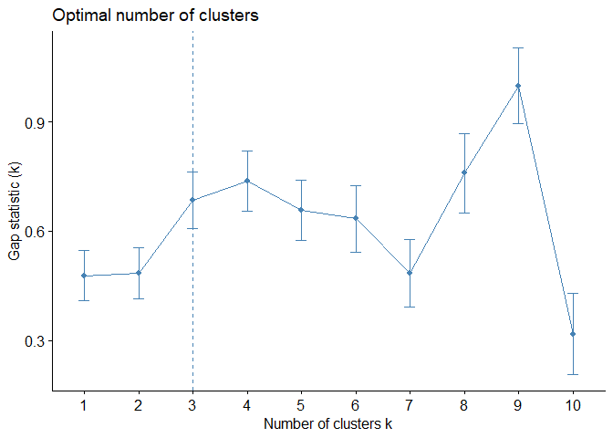
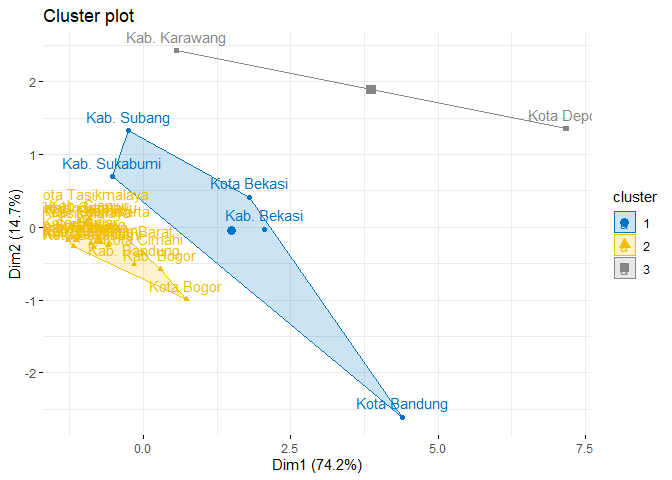
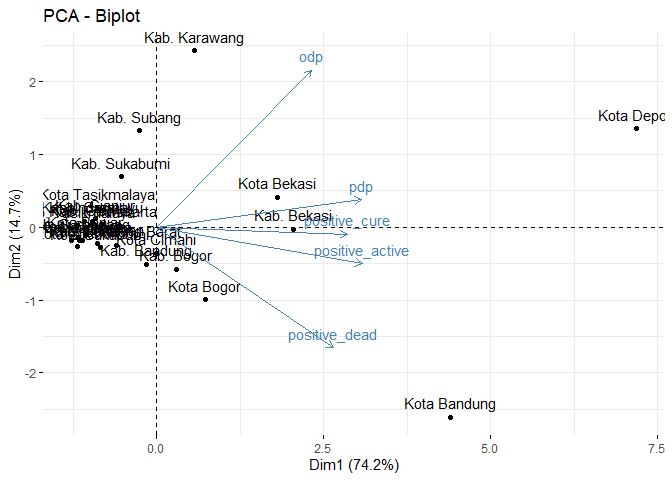

# K-Means Clustering  

[](https://GitHub.com/Naereen/) 

### Load library

Lima library yang dibutuhkan, yaitu **readxl, dplyr, cluster,
factoextra, NbClust**. Jika belum terinstall, silahkan install terlebih
dahulu dengan perintah `install.packages("nama-package")`.

``` r
library(readxl)# import file excel
library(dplyr) # menggunakan pipe operator
library(cluster) # analisis cluster
library(factoextra) # EDA, untuk membuat distance matriks
library(NbClust) # menentukan jumlah cluster
```

### Baca data

Data tersimpan di folder `dataset`

``` r
data <- read_xlsx("../dataset/jabar-2mei.xlsx") %>% 
        as.data.frame()
head(data)
```

    ##              regency odp pdp positive_active positive_cure positive_dead
    ## 1       Kab. Bandung 112  38              30             6             4
    ## 2 Kab. Bandung Barat 199  10              28             0             3
    ## 3        Kab. Bekasi 539 132              30            30             7
    ## 4         Kab. Bogor 146  55              69             5             4
    ## 5        Kab. Ciamis 141  23               2             2             0
    ## 6       Kab. Cianjur 225  33               2             0             1

### Mengganti Row Names

Nama kab/kota dijadikan row index. Kemudian kolom nama kab/kota
dikeluarkan

``` r
row.names(data) <- data$regency 
data <- data[,-1]
head(data)
```

    ##                    odp pdp positive_active positive_cure positive_dead
    ## Kab. Bandung       112  38              30             6             4
    ## Kab. Bandung Barat 199  10              28             0             3
    ## Kab. Bekasi        539 132              30            30             7
    ## Kab. Bogor         146  55              69             5             4
    ## Kab. Ciamis        141  23               2             2             0
    ## Kab. Cianjur       225  33               2             0             1

### Optimal Number of Clusters

``` r
set.seed(123)
fviz_nbclust(data, kmeans, method = "gap_stat")
```



### Compute k-means clustering

``` r
km.data <- kmeans(data, 3, nstart = 25)
km.data
```

    ## K-means clustering with 3 clusters of sizes 5, 20, 2
    ## 
    ## Cluster means:
    ##      odp    pdp positive_active positive_cure positive_dead
    ## 1  602.6 125.00            49.2         14.00           8.2
    ## 2  118.3  23.75            14.6          2.05           1.4
    ## 3 1577.0 388.00           101.0         17.00           7.0
    ## 
    ## Clustering vector:
    ##       Kab. Bandung Kab. Bandung Barat        Kab. Bekasi         Kab. Bogor 
    ##                  2                  2                  1                  2 
    ##        Kab. Ciamis       Kab. Cianjur       Kab. Cirebon         Kab. Garut 
    ##                  2                  2                  2                  2 
    ##     Kab. Indramayu      Kab. Karawang      Kab. Kuningan    Kab. Majalengka 
    ##                  2                  3                  2                  2 
    ##   Kab. Pangandaran    Kab. Purwakarta        Kab. Subang      Kab. Sukabumi 
    ##                  2                  2                  1                  1 
    ##      Kab. Sumedang   Kab. Tasikmalaya       Kota Bandung        Kota Banjar 
    ##                  2                  2                  1                  2 
    ##        Kota Bekasi         Kota Bogor        Kota Cimahi       Kota Cirebon 
    ##                  1                  2                  2                  2 
    ##         Kota Depok      Kota Sukabumi   Kota Tasikmalaya 
    ##                  3                  2                  2 
    ## 
    ## Within cluster sum of squares by cluster:
    ## [1] 207012.8 118600.5 285740.0
    ##  (between_SS / total_SS =  88.4 %)
    ## 
    ## Available components:
    ## 
    ## [1] "cluster"      "centers"      "totss"        "withinss"     "tot.withinss"
    ## [6] "betweenss"    "size"         "iter"         "ifault"

### Mendapatkan Summary Tiap Cluster

``` r
data %>% 
  aggregate(by=list(cluster=km.data$cluster), mean)
```

    ##   cluster    odp    pdp positive_active positive_cure positive_dead
    ## 1       1  602.6 125.00            49.2         14.00           8.2
    ## 2       2  118.3  23.75            14.6          2.05           1.4
    ## 3       3 1577.0 388.00           101.0         17.00           7.0

### Melaukan Pelabelan

Melabeli tiap kab/kota dengan klasternya

``` r
data %>% 
  cbind(cluster = km.data$cluster) %>%
  select(cluster)
```

    ##                    cluster
    ## Kab. Bandung             2
    ## Kab. Bandung Barat       2
    ## Kab. Bekasi              1
    ## Kab. Bogor               2
    ## Kab. Ciamis              2
    ## Kab. Cianjur             2
    ## Kab. Cirebon             2
    ## Kab. Garut               2
    ## Kab. Indramayu           2
    ## Kab. Karawang            3
    ## Kab. Kuningan            2
    ## Kab. Majalengka          2
    ## Kab. Pangandaran         2
    ## Kab. Purwakarta          2
    ## Kab. Subang              1
    ## Kab. Sukabumi            1
    ## Kab. Sumedang            2
    ## Kab. Tasikmalaya         2
    ## Kota Bandung             1
    ## Kota Banjar              2
    ## Kota Bekasi              1
    ## Kota Bogor               2
    ## Kota Cimahi              2
    ## Kota Cirebon             2
    ## Kota Depok               3
    ## Kota Sukabumi            2
    ## Kota Tasikmalaya         2

### Visualize: PCA Biplot

``` r
fviz_cluster(km.data, data = data,
             ellipse.type = "convex",
             palette = "jco",
             ggtheme = theme_minimal())
```



``` r
pca <- prcomp(data, scale = TRUE)
fviz_pca_biplot(pca)
```


