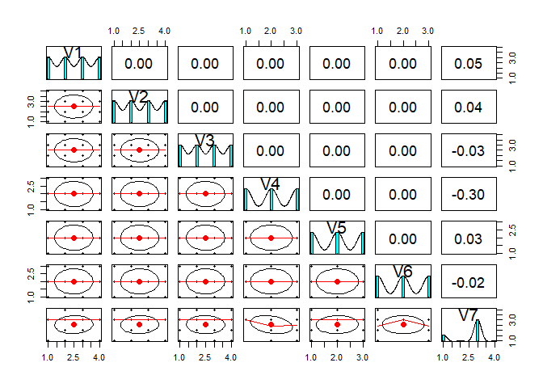
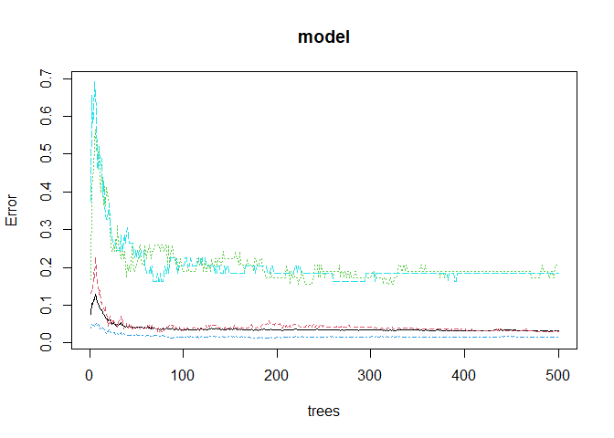
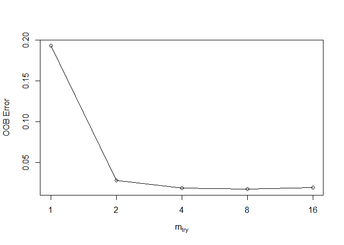

# Random Forest  

[](https://GitHub.com/Naereen/) 

### Load Library

Tiga library yang dibutuhkan, yaitu **randomforest, psych, dan caret**.
Jika belum terinstall, silahkan install terlebih dahulu dengan perintah
`install.packages("nama-package")`.

Library **randomforest** akan digunakan untuk membuat modelnya. Library
**psych** akan digunakan untuk melihat korelasi antar variabel. Library
**caret** digunakan untuk membuat confusion matriks dan melihar akurasi
model.

``` r
library(randomForest)
library(caret)
library(psych)
```

### Baca Data

Data tersimpan di folder `dataset`

``` r
car <- read.csv("../dataset/car.txt", header=FALSE)
head(car)
```

    ##      V1    V2 V3 V4    V5   V6    V7
    ## 1 vhigh vhigh  2  2 small  low unacc
    ## 2 vhigh vhigh  2  2 small  med unacc
    ## 3 vhigh vhigh  2  2 small high unacc
    ## 4 vhigh vhigh  2  2   med  low unacc
    ## 5 vhigh vhigh  2  2   med  med unacc
    ## 6 vhigh vhigh  2  2   med high unacc

### Konversi Data

Ubah tipe variabel menjadi tipe faktor

``` r
for(i in names(car)){
  car[,i]=as.factor(car[,i])
}
str(car)
```

    ## 'data.frame':    1728 obs. of  7 variables:
    ##  $ V1: Factor w/ 4 levels "high","low","med",..: 4 4 4 4 4 4 4 4 4 4 ...
    ##  $ V2: Factor w/ 4 levels "high","low","med",..: 4 4 4 4 4 4 4 4 4 4 ...
    ##  $ V3: Factor w/ 4 levels "2","3","4","5more": 1 1 1 1 1 1 1 1 1 1 ...
    ##  $ V4: Factor w/ 3 levels "2","4","more": 1 1 1 1 1 1 1 1 1 2 ...
    ##  $ V5: Factor w/ 3 levels "big","med","small": 3 3 3 2 2 2 1 1 1 3 ...
    ##  $ V6: Factor w/ 3 levels "high","low","med": 2 3 1 2 3 1 2 3 1 2 ...
    ##  $ V7: Factor w/ 4 levels "acc","good","unacc",..: 3 3 3 3 3 3 3 3 3 3 ...

### Pair Plot

Melihat korelasi dari tiap variabel, kalau ada korelasi yang tinggi,
hilangkan salah satu variabel

``` r
pairs.panels(car)
```



### Split Data

Memecah data menjadi data training(80% dari data awal) dan data test
(20% dari data awal)

``` r
set.seed(1234)
sampel<-sample(2,nrow(car),replace = T, prob = c(0.8,0.2))
trainingdat<-car[sampel==1, ]
testingdat<-car[sampel==2, ]
print(paste("Jumlah Train Data: ", nrow(trainingdat), "| Jumlah Test Data: ", nrow(testingdat)))
```

    ## [1] "Jumlah Train Data:  1393 | Jumlah Test Data:  335"

### Buat Model

``` r
set.seed(123)   
model <- randomForest(V7~., data=trainingdat)
model
```

    ## 
    ## Call:
    ##  randomForest(formula = V7 ~ ., data = trainingdat) 
    ##                Type of random forest: classification
    ##                      Number of trees: 500
    ## No. of variables tried at each split: 2
    ## 
    ##         OOB estimate of  error rate: 3.23%
    ## Confusion matrix:
    ##       acc good unacc vgood class.error
    ## acc   296    6     3     0  0.02950820
    ## good    9   46     0     3  0.20689655
    ## unacc  13    2   966     0  0.01529052
    ## vgood   9    0     0    40  0.18367347

Keterangan :

1.  Banyaknya pohon yang dibuat dari fungsi default adalah 500, jumlah
    pohon bisa diganti dari atribut `ntree`
2.  Banyaknya variabel yang digunakan sebagai kandidat setiap
    percabangan node. Pada fungsi default adalah 2, bisa diganti
3.  Dari atribut `mtry` yang mendekati optimal adalah akar dari jumlah
    atribut.
4.  OOB merupakan error yang berasal dari prediksi yang salah oleh
    model, di mana data yang diprediksi adalah data yang tidak
    dimasukkan ke dalam model saat proses bootstraping

### Model Evaluation

#### Confusion Matrix

``` r
prediksiRF <- predict(model, testingdat)
confusionMatrix(table(prediksiRF, testingdat$V7))
```

    ## Confusion Matrix and Statistics
    ## 
    ##           
    ## prediksiRF acc good unacc vgood
    ##      acc    79    1     6     3
    ##      good    0    9     0     0
    ##      unacc   0    0   223     0
    ##      vgood   0    1     0    13
    ## 
    ## Overall Statistics
    ##                                          
    ##                Accuracy : 0.9672         
    ##                  95% CI : (0.942, 0.9835)
    ##     No Information Rate : 0.6836         
    ##     P-Value [Acc > NIR] : < 2.2e-16      
    ##                                          
    ##                   Kappa : 0.9315         
    ##                                          
    ##  Mcnemar's Test P-Value : NA             
    ## 
    ## Statistics by Class:
    ## 
    ##                      Class: acc Class: good Class: unacc Class: vgood
    ## Sensitivity              1.0000     0.81818       0.9738      0.81250
    ## Specificity              0.9609     1.00000       1.0000      0.99687
    ## Pos Pred Value           0.8876     1.00000       1.0000      0.92857
    ## Neg Pred Value           1.0000     0.99387       0.9464      0.99065
    ## Prevalence               0.2358     0.03284       0.6836      0.04776
    ## Detection Rate           0.2358     0.02687       0.6657      0.03881
    ## Detection Prevalence     0.2657     0.02687       0.6657      0.04179
    ## Balanced Accuracy        0.9805     0.90909       0.9869      0.90468

#### melihat error rate model dengan banyak tree tertentu.

Terlihat dari plot bahwa semakin banyak tree yang dibuat, error rate
semakin asimptotik dengan nilai error tertentu

``` r
plot(model)
```



### Custom Tree

``` r
# menyetel tree
setelan<-tuneRF(trainingdat[,-7],
                trainingdat[,7], 
                stepFactor = 0.5, #besarnya peningkatan mtry tiap iterasi
                plot = TRUE, 
                ntreeTry = 300, #banyak pohon
                trace = TRUE,  
                improve = 0.05)
```

    ## mtry = 2  OOB error = 2.8% 
    ## Searching left ...
    ## mtry = 4     OOB error = 1.87% 
    ## 0.3333333 0.05 
    ## mtry = 8     OOB error = 1.72% 
    ## 0.07692308 0.05 
    ## mtry = 16    OOB error = 1.94% 
    ## -0.125 0.05 
    ## Searching right ...
    ## mtry = 1     OOB error = 19.31% 
    ## -10.20833 0.05



Terlihat dari plot setelan, OOB terendah berada pada **mtry = 16**.

#### Membuat model dengan mtry = 16

``` r
model16 <- randomForest(V7~., data = trainingdat, ntree = 300, mtry = 16, importance = TRUE, proximity = TRUE)
model16
```

    ## 
    ## Call:
    ##  randomForest(formula = V7 ~ ., data = trainingdat, ntree = 300,      mtry = 16, importance = TRUE, proximity = TRUE) 
    ##                Type of random forest: classification
    ##                      Number of trees: 300
    ## No. of variables tried at each split: 6
    ## 
    ##         OOB estimate of  error rate: 1.87%
    ## Confusion matrix:
    ##       acc good unacc vgood class.error
    ## acc   294    6     3     2 0.036065574
    ## good    2   53     2     1 0.086206897
    ## unacc   5    2   974     0 0.007135576
    ## vgood   1    2     0    46 0.061224490

#### Confusion matrix mtry = 16

Terlihat dari model hasil perubahan mtry, akurasi model meningkat
sebanyak 5%

``` r
prediksiRF<-predict(model16,testingdat)
confusionMatrix(table(prediksiRF, testingdat$V7))
```

    ## Confusion Matrix and Statistics
    ## 
    ##           
    ## prediksiRF acc good unacc vgood
    ##      acc    78    0     3     2
    ##      good    0   11     0     0
    ##      unacc   1    0   226     0
    ##      vgood   0    0     0    14
    ## 
    ## Overall Statistics
    ##                                           
    ##                Accuracy : 0.9821          
    ##                  95% CI : (0.9614, 0.9934)
    ##     No Information Rate : 0.6836          
    ##     P-Value [Acc > NIR] : < 2.2e-16       
    ##                                           
    ##                   Kappa : 0.9623          
    ##                                           
    ##  Mcnemar's Test P-Value : NA              
    ## 
    ## Statistics by Class:
    ## 
    ##                      Class: acc Class: good Class: unacc Class: vgood
    ## Sensitivity              0.9873     1.00000       0.9869      0.87500
    ## Specificity              0.9805     1.00000       0.9906      1.00000
    ## Pos Pred Value           0.9398     1.00000       0.9956      1.00000
    ## Neg Pred Value           0.9960     1.00000       0.9722      0.99377
    ## Prevalence               0.2358     0.03284       0.6836      0.04776
    ## Detection Rate           0.2328     0.03284       0.6746      0.04179
    ## Detection Prevalence     0.2478     0.03284       0.6776      0.04179
    ## Balanced Accuracy        0.9839     1.00000       0.9887      0.93750
