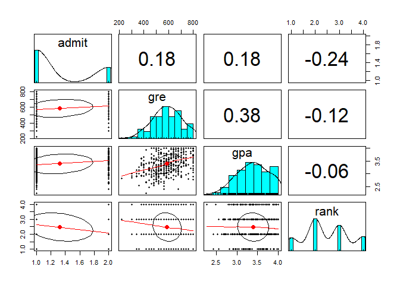

# Regresi Logistic  

[](https://GitHub.com/Naereen/) 

### Load Library

Dua library yang dibutuhkan, yaitu **psych, dan caret**. Jika belum
terinstall, silahkan install terlebih dahulu dengan perintah
`install.packages("nama-package")`.

Library **psych** akan digunakan untuk melihat korelasi antar variabel
dan library **caret** digunakan untuk membuat confusion matriks dan
melihar akurasi model.

``` r
library(psych)
library(caret)
```

### Baca Data

Data tersimpan di folder `dataset`

``` r
ipeh<- read.csv("../dataset/data_Ipeh.csv", header=T)
head(ipeh)
```

    ##   admit gre  gpa rank
    ## 1     0 380 3.61    3
    ## 2     1 660 3.67    3
    ## 3     1 800 4.00    1
    ## 4     1 640 3.19    4
    ## 5     0 520 2.93    4
    ## 6     1 760 3.00    2

### Konversi Data

Mengubah variabel **admit** dan **rank** menjadi bertipe factor

``` r
ipeh$admit  <- as.factor(ipeh$admit)
ipeh$rank <- as.factor(ipeh$rank)
str(ipeh)
```

    ## 'data.frame':    400 obs. of  4 variables:
    ##  $ admit: Factor w/ 2 levels "0","1": 1 2 2 2 1 2 2 1 2 1 ...
    ##  $ gre  : int  380 660 800 640 520 760 560 400 540 700 ...
    ##  $ gpa  : num  3.61 3.67 4 3.19 2.93 3 2.98 3.08 3.39 3.92 ...
    ##  $ rank : Factor w/ 4 levels "1","2","3","4": 3 3 1 4 4 2 1 2 3 2 ...

### Pair Plot

``` r
pairs.panels(ipeh)
```



Terlihat korelasi antara variabel tidak terlalu signifikan, kita
misalkan tidak ada multikolinear. Pada kasus asli harap diuji dengan uji
multikolinearitas

### Split Data

Memecah data menjadi data training(80% dari data awal) dan data test
(20% dari data awal)

``` r
set.seed(1234)
sampel <- sample(2, nrow(ipeh), replace = T, prob = c(0.8,0.2))
trainingdat <- ipeh[sampel==1, ]
testingdat <- ipeh[sampel==2, ]
print(paste("Jumlah Train Data: ", nrow(trainingdat), "| Jumlah Test Data: ", nrow(testingdat)))
```

    ## [1] "Jumlah Train Data:  325 | Jumlah Test Data:  75"

### Buat Model

Karena kasus ini hanya admit atau tidak admit, maka model yang dibangun
adalah model regresi logistik sederhana. Jika target class memiliki
banyak nilai, gunakan multinomial.

``` r
modellogreg<-glm(admit~., data=trainingdat, family = "binomial")
summary(modellogreg)
```

    ## 
    ## Call:
    ## glm(formula = admit ~ ., family = "binomial", data = trainingdat)
    ## 
    ## Deviance Residuals: 
    ##     Min       1Q   Median       3Q      Max  
    ## -1.5873  -0.8679  -0.6181   1.1301   2.1178  
    ## 
    ## Coefficients:
    ##              Estimate Std. Error z value Pr(>|z|)    
    ## (Intercept) -5.009514   1.316514  -3.805 0.000142 ***
    ## gre          0.001631   0.001217   1.340 0.180180    
    ## gpa          1.166408   0.388899   2.999 0.002706 ** 
    ## rank2       -0.570976   0.358273  -1.594 0.111005    
    ## rank3       -1.125341   0.383372  -2.935 0.003331 ** 
    ## rank4       -1.532942   0.477377  -3.211 0.001322 ** 
    ## ---
    ## Signif. codes:  0 '***' 0.001 '**' 0.01 '*' 0.05 '.' 0.1 ' ' 1
    ## 
    ## (Dispersion parameter for binomial family taken to be 1)
    ## 
    ##     Null deviance: 404.39  on 324  degrees of freedom
    ## Residual deviance: 369.99  on 319  degrees of freedom
    ## AIC: 381.99
    ## 
    ## Number of Fisher Scoring iterations: 4

#### Koefisien model

``` r
coefficients(modellogreg)
```

    ##  (Intercept)          gre          gpa        rank2        rank3        rank4 
    ## -5.009514038  0.001631284  1.166408495 -0.570976207 -1.125340854 -1.532942235

### Model Evaluation

#### Melakukan Prediksi

``` r
prediksilogreg <- predict(modellogreg, testingdat, type="response") #output berupa peluang
prediksilogreg
```

    ##          5         14         16         26         28         29         39 
    ## 0.09307860 0.30026148 0.20760987 0.63750895 0.20885837 0.36534183 0.24712788 
    ##         40         60         61         72         81         86         90 
    ## 0.10334370 0.09326429 0.29735712 0.06616438 0.11732879 0.22160716 0.54035985 
    ##         92        113        116        117        122        123        124 
    ## 0.60126473 0.11421749 0.38473727 0.30182639 0.15667708 0.12321589 0.13665966 
    ##        131        135        137        140        142        149        154 
    ## 0.29492585 0.22687072 0.14870468 0.53618637 0.21504158 0.30316978 0.23995312 
    ##        156        158        169        185        187        192        194 
    ## 0.09445760 0.48731394 0.34218353 0.07780619 0.26686225 0.33164789 0.14992853 
    ##        195        196        197        199        210        216        220 
    ## 0.36487149 0.38235497 0.18583057 0.28454619 0.36542009 0.15923133 0.38235497 
    ##        227        234        240        245        249        261        277 
    ## 0.40291075 0.08823289 0.27511047 0.35830267 0.31435122 0.30075894 0.27148446 
    ##        283        290        293        302        305        308        311 
    ## 0.19128234 0.03837444 0.46120179 0.29751976 0.07762686 0.36812908 0.36454259 
    ##        320        322        330        332        333        339        341 
    ## 0.42487299 0.34200836 0.09036082 0.29508772 0.29487876 0.40224652 0.12354124 
    ##        344        349        355        356        365        366        369 
    ## 0.25632931 0.26720615 0.42786370 0.37939191 0.45589933 0.10820364 0.64617430 
    ##        371        373        389        390        396 
    ## 0.42501080 0.25397332 0.30175527 0.39117533 0.52411628

Menyaring prediksi, lebih besar dari 0.05 dikategorikan 1 (admit) selain
itu dikategorikan 0 (tidak diadmit)

``` r
pred <- ifelse(prediksilogreg>0.5, 1, 0)
pred
```

    ##   5  14  16  26  28  29  39  40  60  61  72  81  86  90  92 113 116 117 122 123 
    ##   0   0   0   1   0   0   0   0   0   0   0   0   0   1   1   0   0   0   0   0 
    ## 124 131 135 137 140 142 149 154 156 158 169 185 187 192 194 195 196 197 199 210 
    ##   0   0   0   0   1   0   0   0   0   0   0   0   0   0   0   0   0   0   0   0 
    ## 216 220 227 234 240 245 249 261 277 283 290 293 302 305 308 311 320 322 330 332 
    ##   0   0   0   0   0   0   0   0   0   0   0   0   0   0   0   0   0   0   0   0 
    ## 333 339 341 344 349 355 356 365 366 369 371 373 389 390 396 
    ##   0   0   0   0   0   0   0   0   0   1   0   0   0   0   1

#### Confusion Matrix

``` r
confusionMatrix(table(pred, testingdat$admit))
```

    ## Confusion Matrix and Statistics
    ## 
    ##     
    ## pred  0  1
    ##    0 48 21
    ##    1  2  4
    ##                                           
    ##                Accuracy : 0.6933          
    ##                  95% CI : (0.5762, 0.7947)
    ##     No Information Rate : 0.6667          
    ##     P-Value [Acc > NIR] : 0.3612408       
    ##                                           
    ##                   Kappa : 0.1481          
    ##                                           
    ##  Mcnemar's Test P-Value : 0.0001746       
    ##                                           
    ##             Sensitivity : 0.9600          
    ##             Specificity : 0.1600          
    ##          Pos Pred Value : 0.6957          
    ##          Neg Pred Value : 0.6667          
    ##              Prevalence : 0.6667          
    ##          Detection Rate : 0.6400          
    ##    Detection Prevalence : 0.9200          
    ##       Balanced Accuracy : 0.5600          
    ##                                           
    ##        'Positive' Class : 0               
    ##
