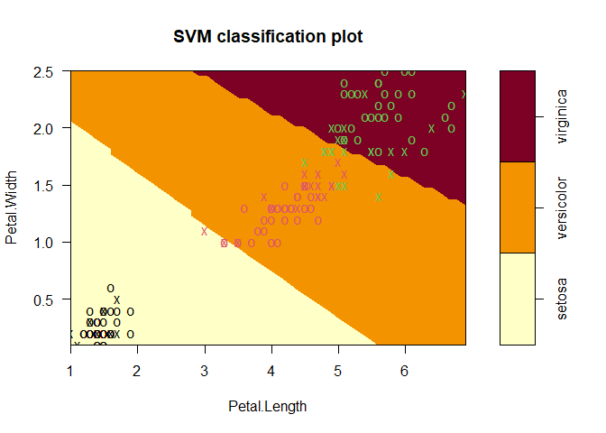
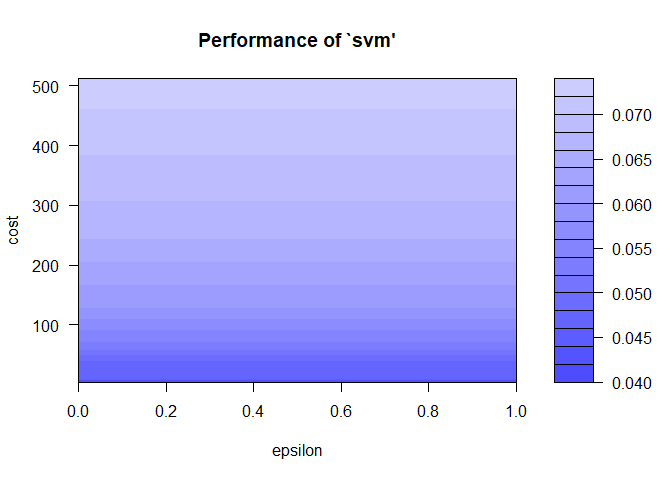

# Support Vector Mechine (SVM)  

[](https://GitHub.com/Naereen/) 

### Load Library

Tiga library yang dibutuhkan, yaitu **tidyverse, caret, dan e1071**.
Jika belum terinstall, silahkan install terlebih dahulu dengan perintah
`install.packages("nama-package")`.

Library **tidyverse** akan digunakan untuk plotting dan mengolah
variabel. Library **e1071** digunakan untuk melakukan pemodelan SVM.
Library **caret** digunakan untuk membuat confusion matriks dan melihar
akurasi model.

``` r
library(tidyverse)
library(e1071)
library(caret)
```

### Load Data

``` r
data("iris")
str(iris)
```

    ## 'data.frame':    150 obs. of  5 variables:
    ##  $ Sepal.Length: num  5.1 4.9 4.7 4.6 5 5.4 4.6 5 4.4 4.9 ...
    ##  $ Sepal.Width : num  3.5 3 3.2 3.1 3.6 3.9 3.4 3.4 2.9 3.1 ...
    ##  $ Petal.Length: num  1.4 1.4 1.3 1.5 1.4 1.7 1.4 1.5 1.4 1.5 ...
    ##  $ Petal.Width : num  0.2 0.2 0.2 0.2 0.2 0.4 0.3 0.2 0.2 0.1 ...
    ##  $ Species     : Factor w/ 3 levels "setosa","versicolor",..: 1 1 1 1 1 1 1 1 1 1 ...

### Scatter Plot

Scatterplot untuk melihat hubungan panjang, lebar dan warna dari data
iris.

``` r
qplot(Petal.Length, Petal.Width, color = Species, data=iris)
```


### Buat Model

``` r
modelSVM <- svm(Species~., data=iris)
summary(modelSVM)
```

    ## 
    ## Call:
    ## svm(formula = Species ~ ., data = iris)
    ## 
    ## 
    ## Parameters:
    ##    SVM-Type:  C-classification 
    ##  SVM-Kernel:  radial 
    ##        cost:  1 
    ## 
    ## Number of Support Vectors:  51
    ## 
    ##  ( 8 22 21 )
    ## 
    ## 
    ## Number of Classes:  3 
    ## 
    ## Levels: 
    ##  setosa versicolor virginica

Support vector kernel default adalah bertipe radial. Terdapat beberapa
pilihan yaitu sigmoid, polynomial, dan linear.

### SVM Classification Plot

Karena terdapat lebih dari 3 variabel pada dataset ini, perlu
didefinisikan variabel mana yang akan ditampilkan, pada kasus ini petal
width dan length.

``` r
plot(modelSVM, data=iris,
     Petal.Width~Petal.Length,
     slice= list(Sepal.Width = 3,
                 Sepal.Length = 4))
```



### Confusion Matrix

``` r
pred <- predict(modelSVM, iris)
confusionMatrix(table(Predicted = pred, Actual=iris$Species))
```

    ## Confusion Matrix and Statistics
    ## 
    ##             Actual
    ## Predicted    setosa versicolor virginica
    ##   setosa         50          0         0
    ##   versicolor      0         48         2
    ##   virginica       0          2        48
    ## 
    ## Overall Statistics
    ##                                           
    ##                Accuracy : 0.9733          
    ##                  95% CI : (0.9331, 0.9927)
    ##     No Information Rate : 0.3333          
    ##     P-Value [Acc > NIR] : < 2.2e-16       
    ##                                           
    ##                   Kappa : 0.96            
    ##                                           
    ##  Mcnemar's Test P-Value : NA              
    ## 
    ## Statistics by Class:
    ## 
    ##                      Class: setosa Class: versicolor Class: virginica
    ## Sensitivity                 1.0000            0.9600           0.9600
    ## Specificity                 1.0000            0.9800           0.9800
    ## Pos Pred Value              1.0000            0.9600           0.9600
    ## Neg Pred Value              1.0000            0.9800           0.9800
    ## Prevalence                  0.3333            0.3333           0.3333
    ## Detection Rate              0.3333            0.3200           0.3200
    ## Detection Prevalence        0.3333            0.3333           0.3333
    ## Balanced Accuracy           1.0000            0.9700           0.9700

### Mencari Model Terbaik

``` r
set.seed(123)
ngulikngulik <- tune(svm, Species~., data=iris,
                     ranges = list(epsilon = seq(0,1,0.1),
                     cost = 2^(2:9)))
ngulikngulik
```

    ## 
    ## Parameter tuning of 'svm':
    ## 
    ## - sampling method: 10-fold cross validation 
    ## 
    ## - best parameters:
    ##  epsilon cost
    ##        0    4
    ## 
    ## - best performance: 0.04

Perhatikan nilai cost, jika cost yang ditentukan bernilai besar, bisa
terjadi over-fitting, jika terlalu kecil bisa terjadi under-fitting yang
berakibat rendahnya akurasi.

#### Performance of SVM Plot

``` r
plot(ngulikngulik)
```



#### Summary

``` r
summary(ngulikngulik)
```

    ## 
    ## Parameter tuning of 'svm':
    ## 
    ## - sampling method: 10-fold cross validation 
    ## 
    ## - best parameters:
    ##  epsilon cost
    ##        0    4
    ## 
    ## - best performance: 0.04 
    ## 
    ## - Detailed performance results:
    ##    epsilon cost      error dispersion
    ## 1      0.0    4 0.04000000 0.04661373
    ## 2      0.1    4 0.04000000 0.04661373
    ## 3      0.2    4 0.04000000 0.04661373
    ## 4      0.3    4 0.04000000 0.04661373
    ## 5      0.4    4 0.04000000 0.04661373
    ## 6      0.5    4 0.04000000 0.04661373
    ## 7      0.6    4 0.04000000 0.04661373
    ## 8      0.7    4 0.04000000 0.04661373
    ## 9      0.8    4 0.04000000 0.04661373
    ## 10     0.9    4 0.04000000 0.04661373
    ## 11     1.0    4 0.04000000 0.04661373
    ## 12     0.0    8 0.04666667 0.06324555
    ## 13     0.1    8 0.04666667 0.06324555
    ## 14     0.2    8 0.04666667 0.06324555
    ## 15     0.3    8 0.04666667 0.06324555
    ## 16     0.4    8 0.04666667 0.06324555
    ## 17     0.5    8 0.04666667 0.06324555
    ## 18     0.6    8 0.04666667 0.06324555
    ## 19     0.7    8 0.04666667 0.06324555
    ## 20     0.8    8 0.04666667 0.06324555
    ## 21     0.9    8 0.04666667 0.06324555
    ## 22     1.0    8 0.04666667 0.06324555
    ## 23     0.0   16 0.04666667 0.04499657
    ## 24     0.1   16 0.04666667 0.04499657
    ## 25     0.2   16 0.04666667 0.04499657
    ## 26     0.3   16 0.04666667 0.04499657
    ## 27     0.4   16 0.04666667 0.04499657
    ## 28     0.5   16 0.04666667 0.04499657
    ## 29     0.6   16 0.04666667 0.04499657
    ## 30     0.7   16 0.04666667 0.04499657
    ## 31     0.8   16 0.04666667 0.04499657
    ## 32     0.9   16 0.04666667 0.04499657
    ## 33     1.0   16 0.04666667 0.04499657
    ## 34     0.0   32 0.04666667 0.04499657
    ## 35     0.1   32 0.04666667 0.04499657
    ## 36     0.2   32 0.04666667 0.04499657
    ## 37     0.3   32 0.04666667 0.04499657
    ## 38     0.4   32 0.04666667 0.04499657
    ## 39     0.5   32 0.04666667 0.04499657
    ## 40     0.6   32 0.04666667 0.04499657
    ## 41     0.7   32 0.04666667 0.04499657
    ## 42     0.8   32 0.04666667 0.04499657
    ## 43     0.9   32 0.04666667 0.04499657
    ## 44     1.0   32 0.04666667 0.04499657
    ## 45     0.0   64 0.05333333 0.06126244
    ## 46     0.1   64 0.05333333 0.06126244
    ## 47     0.2   64 0.05333333 0.06126244
    ## 48     0.3   64 0.05333333 0.06126244
    ## 49     0.4   64 0.05333333 0.06126244
    ## 50     0.5   64 0.05333333 0.06126244
    ## 51     0.6   64 0.05333333 0.06126244
    ## 52     0.7   64 0.05333333 0.06126244
    ## 53     0.8   64 0.05333333 0.06126244
    ## 54     0.9   64 0.05333333 0.06126244
    ## 55     1.0   64 0.05333333 0.06126244
    ## 56     0.0  128 0.06000000 0.05837300
    ## 57     0.1  128 0.06000000 0.05837300
    ## 58     0.2  128 0.06000000 0.05837300
    ## 59     0.3  128 0.06000000 0.05837300
    ## 60     0.4  128 0.06000000 0.05837300
    ## 61     0.5  128 0.06000000 0.05837300
    ## 62     0.6  128 0.06000000 0.05837300
    ## 63     0.7  128 0.06000000 0.05837300
    ## 64     0.8  128 0.06000000 0.05837300
    ## 65     0.9  128 0.06000000 0.05837300
    ## 66     1.0  128 0.06000000 0.05837300
    ## 67     0.0  256 0.06666667 0.06285394
    ## 68     0.1  256 0.06666667 0.06285394
    ## 69     0.2  256 0.06666667 0.06285394
    ## 70     0.3  256 0.06666667 0.06285394
    ## 71     0.4  256 0.06666667 0.06285394
    ## 72     0.5  256 0.06666667 0.06285394
    ## 73     0.6  256 0.06666667 0.06285394
    ## 74     0.7  256 0.06666667 0.06285394
    ## 75     0.8  256 0.06666667 0.06285394
    ## 76     0.9  256 0.06666667 0.06285394
    ## 77     1.0  256 0.06666667 0.06285394
    ## 78     0.0  512 0.07333333 0.06629526
    ## 79     0.1  512 0.07333333 0.06629526
    ## 80     0.2  512 0.07333333 0.06629526
    ## 81     0.3  512 0.07333333 0.06629526
    ## 82     0.4  512 0.07333333 0.06629526
    ## 83     0.5  512 0.07333333 0.06629526
    ## 84     0.6  512 0.07333333 0.06629526
    ## 85     0.7  512 0.07333333 0.06629526
    ## 86     0.8  512 0.07333333 0.06629526
    ## 87     0.9  512 0.07333333 0.06629526
    ## 88     1.0  512 0.07333333 0.06629526

Didapat model terbaik adalah model dengan epsilon 0 dan cost 4.

``` r
bestmodel <- ngulikngulik$best.model
summary(bestmodel)
```

    ## 
    ## Call:
    ## best.tune(method = svm, train.x = Species ~ ., data = iris, ranges = list(epsilon = seq(0, 
    ##     1, 0.1), cost = 2^(2:9)))
    ## 
    ## 
    ## Parameters:
    ##    SVM-Type:  C-classification 
    ##  SVM-Kernel:  radial 
    ##        cost:  4 
    ## 
    ## Number of Support Vectors:  37
    ## 
    ##  ( 6 17 14 )
    ## 
    ## 
    ## Number of Classes:  3 
    ## 
    ## Levels: 
    ##  setosa versicolor virginica

#### Confusion Matrix Best Model

``` r
pred <- predict(bestmodel, iris)
confusionMatrix(table(Predicted = pred, Actual=iris$Species))
```

    ## Confusion Matrix and Statistics
    ## 
    ##             Actual
    ## Predicted    setosa versicolor virginica
    ##   setosa         50          0         0
    ##   versicolor      0         48         0
    ##   virginica       0          2        50
    ## 
    ## Overall Statistics
    ##                                           
    ##                Accuracy : 0.9867          
    ##                  95% CI : (0.9527, 0.9984)
    ##     No Information Rate : 0.3333          
    ##     P-Value [Acc > NIR] : < 2.2e-16       
    ##                                           
    ##                   Kappa : 0.98            
    ##                                           
    ##  Mcnemar's Test P-Value : NA              
    ## 
    ## Statistics by Class:
    ## 
    ##                      Class: setosa Class: versicolor Class: virginica
    ## Sensitivity                 1.0000            0.9600           1.0000
    ## Specificity                 1.0000            1.0000           0.9800
    ## Pos Pred Value              1.0000            1.0000           0.9615
    ## Neg Pred Value              1.0000            0.9804           1.0000
    ## Prevalence                  0.3333            0.3333           0.3333
    ## Detection Rate              0.3333            0.3200           0.3333
    ## Detection Prevalence        0.3333            0.3200           0.3467
    ## Balanced Accuracy           1.0000            0.9800           0.9900
